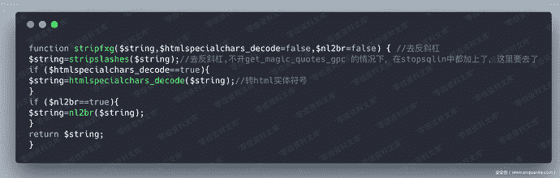
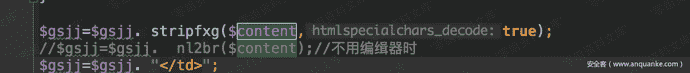
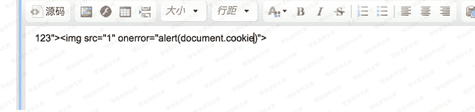

# （CVE-2018-14962）Zzcms 8.3 储存型xss

> 原文：[https://www.zhihuifly.com/t/topic/3315](https://www.zhihuifly.com/t/topic/3315)

# （CVE-2018-14962）Zzcms 8.3 储存型xss

## 一、漏洞简介

## 二、漏洞影响

Zzcms 8.3

## 三、复现过程

一个存储型xss，最底层的原因还是因为调用了`stripfxg`函数，消除了自己的过滤，然后在输出的时候，导致了xss漏洞。

先看一下输出位置，在/zt/show.php 的211 行：

然后追踪这个变量的值，找到了是在用户在修改自己公司简介处添加的数据
然后我们来测试一下：

保存，然后访问一下/zt/show.php?id=1，就可以看到效果：

## 参考链接

> https://www.anquanke.com/post/id/156660