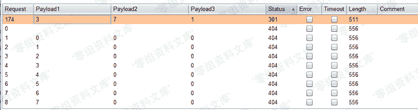
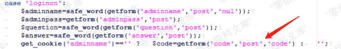
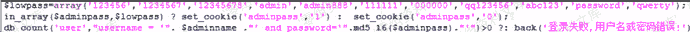
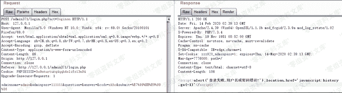
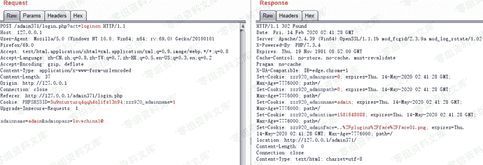
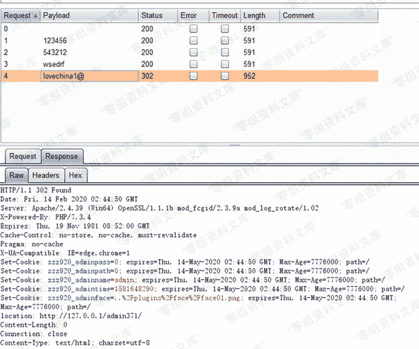
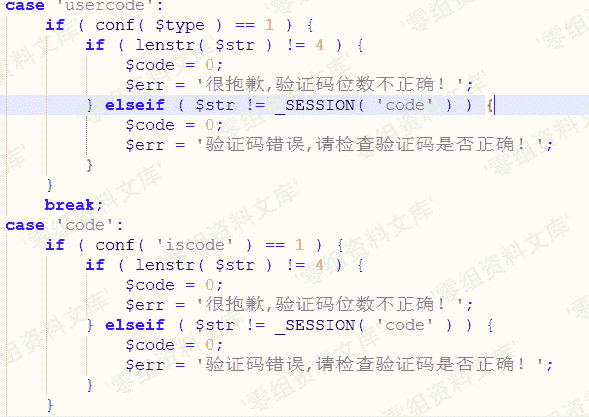

# Zzzcms 1.75 后台爆破+验证码问题

> 原文：[https://www.zhihuifly.com/t/topic/3318](https://www.zhihuifly.com/t/topic/3318)

# Zzzcms 1.75 后台爆破+验证码问题

## 一、漏洞简介

## 二、漏洞影响

Zzzcms 1.75

## 三、复现过程

### 后台寻找

后台寻找方法，该后台大部分admin+三位数字，所以可以采用爆破的方式获取后台地址 该后台地址为admin371

### 验证码问题

*   （一）管理员登录面验证码登录

在 admin371/login.php 19行可以看出get_cookie('adminname')不为空就可以绕过，如何获得get_cookie('adminname')的值

在24行可以看出如果存在密码的话会返回cookie中adminpass值，根据返回的adminpass的形式可以推断出adminname的值

可以看到adminpass为zzz920_adminpass，所以推断adminname为zzz920_adminname

可以看到已经在无验证码的情况下已经登录成功了

*   （二）验证码不刷新不过期

在inc/zzz_main.php中582行可以看到从SESSION中取code的值，在iimgcode.php中只要不刷新就不会重新生成code，导致验证码不过期

