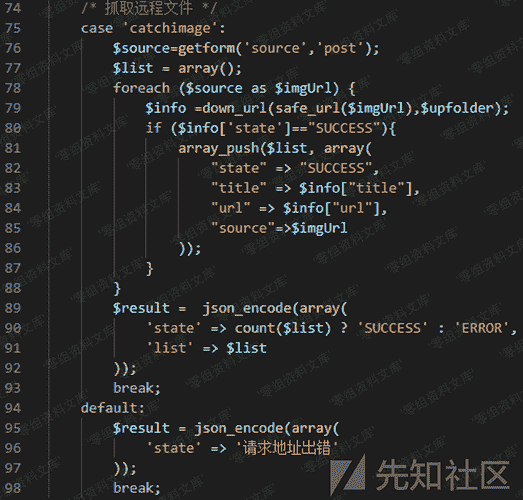
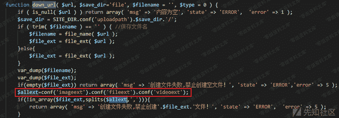
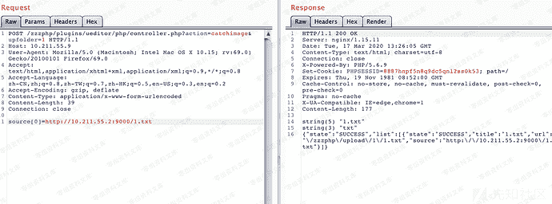
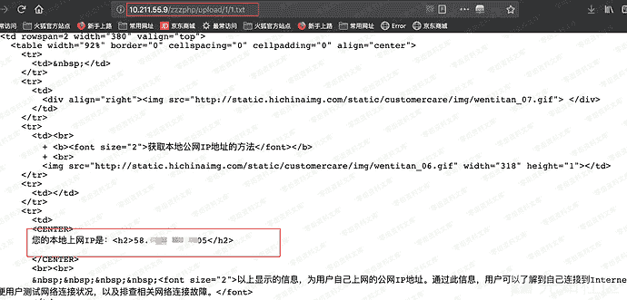

# Zzzcms 1.75 ssrf

> 原文：[https://www.zhihuifly.com/t/topic/3320](https://www.zhihuifly.com/t/topic/3320)

# Zzzcms 1.75 ssrf

## 一、漏洞简介

存在这个问题的接口主要功能是远程下载保存图片，但是后缀限制死了，因此远程下载webshell的目的应该是达不到了，退而求其次也可以作为SSRF利用，比如需要获取目标主机的真实IP地址的场景下。

## 二、漏洞影响

Zzzcms 1.75

## 三、复现过程

### 漏洞分析

功能实现在

```
plugins/ueditor/php/controller.php 
```



传入的post参数进入safe_url函数进行处理，然后传入down_url函数。这里safe_url函数作用不大，主要是在down_url中的逻辑。

在down_url函数逻辑中根据url获取了保存的文件名和后缀，并且进行了文件名后缀的白名单限制和检测。



最后通过readfile进行远程资源获取（本地也可以，支持file协议），这里通过file_ext函数传入`http://XXXX/x.php?x.jpg`得到的文件名后缀仍然是php，对问号进行了处理，因此利用SSRF达到任意地址访问需要利用301/302跳转实现，本地搭建一个提供跳转的http服务器，然后进行访问：

```
from flask import Flask,redirect,request
app = Flask(__name__)
@app.route('/1.txt')
def index(page_name=''):
    #return redirect('file:///etc/passwd', code=301) #not work
    return redirect('http://www.net.cn/static/customercare/yourip.asp', code=301)
if __name__ == '__main__':
    app.run(host='0.0.0.0', port=9000, debug=app.debug) 
```





## 参考链接

> https://xz.aliyun.com/t/7414