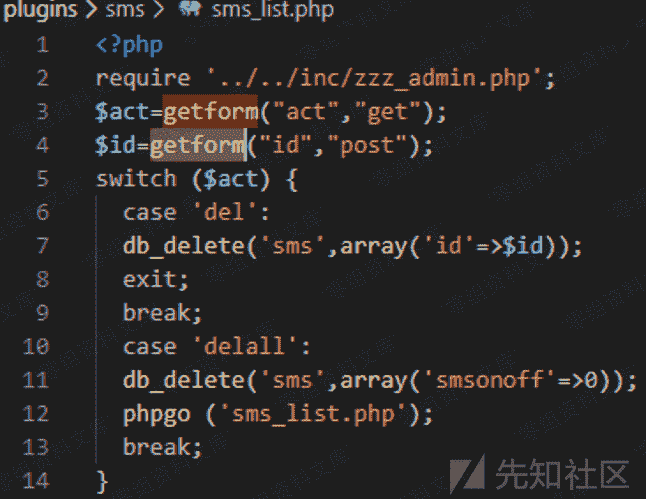
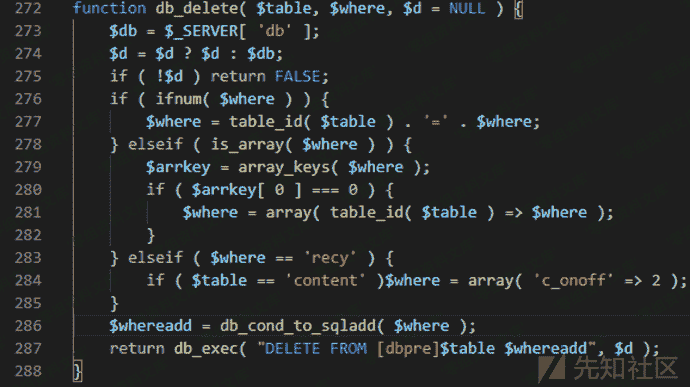
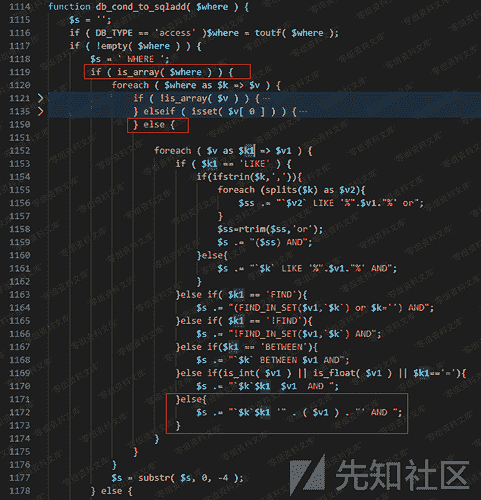
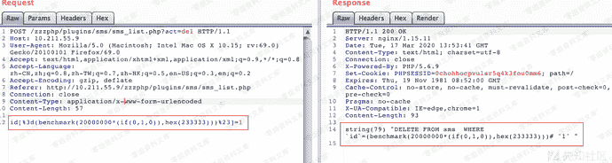

# Zzzcms 1.75 前台sql注入

> 原文：[https://www.zhihuifly.com/t/topic/3321](https://www.zhihuifly.com/t/topic/3321)

# Zzzcms 1.75 前台sql注入

## 一、漏洞简介

## 二、漏洞影响

Zzzcms 1.75

## 三、复现过程

注入点的入口在plugins\sms\sms_list.php文件中，

其中id参数是用户post输入的参数，并且在第7行中调用了db_delete去删除指定id的数据，进入db_delete函数后可以看到函数本身并不长，逻辑还是较为清晰的。

在获取到代表着数据库连接的$d后开始处理传入的$where条件变量，接着调用db_cond_to_sqladd函数后传入db_exec进行sql语句的执行过程。

这里继续看db_cond_to_sqladd函数部分，该函数代码部分比较长（70行），但只需要着重看其中几个处理分支即可。注入点传入的条件变量是数组，自然进入下面的第一个红框控制流中。接着，假如传入的参数id也是数组并且不存在key为0的元素，那么会进入第二个红框控制流中。

关键点在于第三个红框的控制流中，作为键名key的$k1直接拼接到了条件语句中。

在代码中加入sql语句回显进行测试，当我们传入如下post的id后，返回的sql语句如下所示，已经形成可以利用的SQL注入点了：

利用BENCHMARK函数可以直接构造exp利用时间盲注得到数据库信息。

## 参考链接

> https://xz.aliyun.com/t/7414