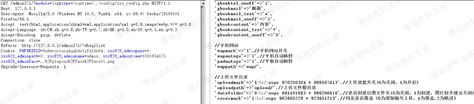
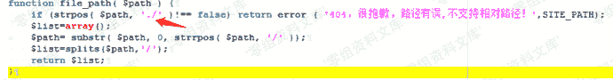
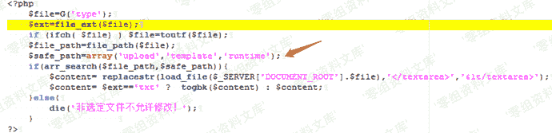
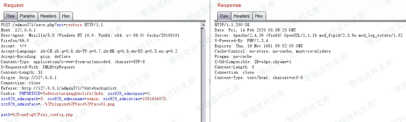
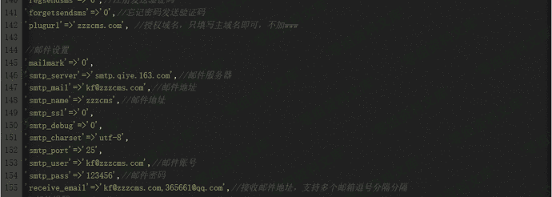
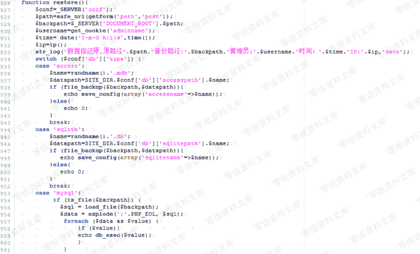
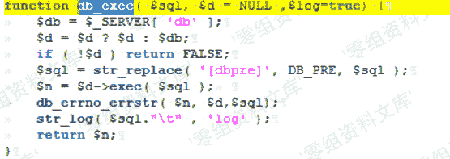
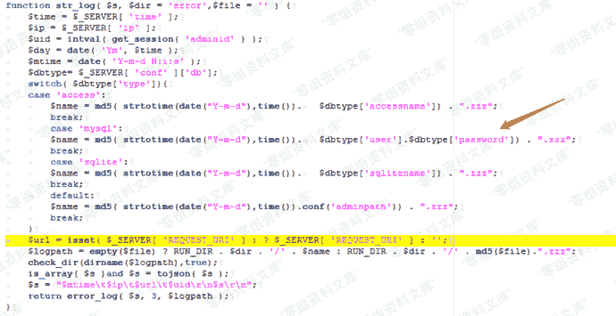
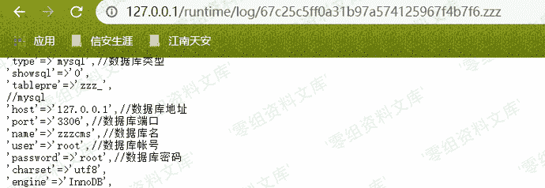

# Zzzcms 1.75 后台任意文件读取

> 原文：[https://www.zhihuifly.com/t/topic/3323](https://www.zhihuifly.com/t/topic/3323)

# Zzzcms 1.75 后台任意文件读取

## 一、漏洞简介

*   管理员权限
*   后台管理目录
*   后台数据库为mysql

## 二、漏洞影响

Zzzcms 1.75

## 三、复现过程

### 任意文件读取（一）

首先来看防护规则，不允许出现./

看 safe_path 只能是upload template runtime路径下的

所以构造/runtime/..\config/zzz_config.php 即可绕过防护

### 任意文件读取（二）

首先来看restore函数，mysql数据库，发现path是可控的，看955行，跟进到load_file函数

在zzz_file.php文件中，如果存在该path,则通过file_get_contents读取

然后现在的想法是如何输入出来，跟进到db_exec()函数

在zzz_db.php中，看str_log把sql语句写入到了log中

在zzz.file.php中，跟进到str_log文件，看到文件的命名规则，

文件命名规则为当天时间的时间戳+数据库用户+数据库密码，并且是未授权访问

