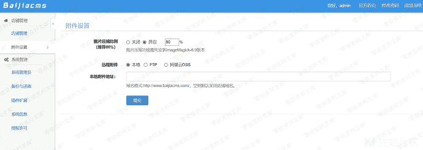
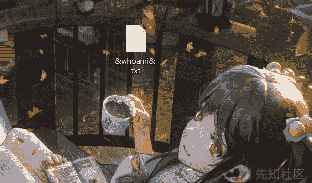
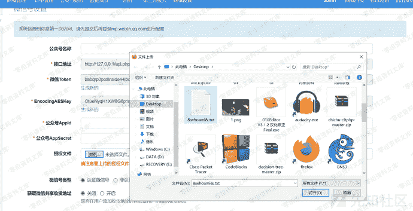

# 百家cms v4.1.4 远程命令执行漏洞

> 原文：[https://www.zhihuifly.com/t/topic/3327](https://www.zhihuifly.com/t/topic/3327)

# 百家cms v4.1.4 远程命令执行漏洞

## 一、漏洞简介

## 二、漏洞影响

百家cms v4.1.4

## 三、复现过程

```
# 需要后台权限
http://www.0-sec.org/index.php?mod=site&act=weixin&do=setting&beid=1 
```

首先需要在设置里将图片缩放打开



本地创建`&命令&.txt`格式的文件



访问payload，并进行上传



命令执行


## 参考链接

> https://xz.aliyun.com/t/7542