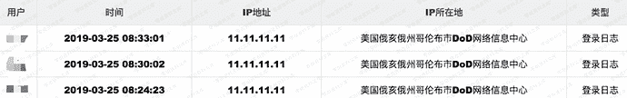

# 通达oa XFF导致日志混淆

> 原文：[https://www.zhihuifly.com/t/topic/3333](https://www.zhihuifly.com/t/topic/3333)

# 通达oa XFF导致日志混淆

## 一、漏洞简介

## 二、漏洞影响

2013、2015版本

## 三、复现过程

使用header中的X-Forwarded-For想伪装⾃己的IP地址，你的IP地址会直接进⼊安全审计日志⾥面。很多地方你也可以配置这个来进行XSS盲打，但是此处不存在XSS。

