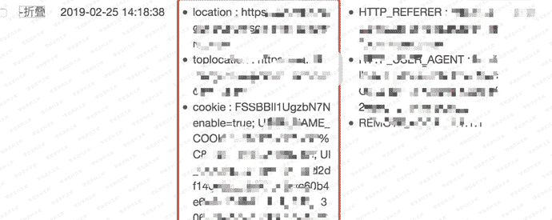
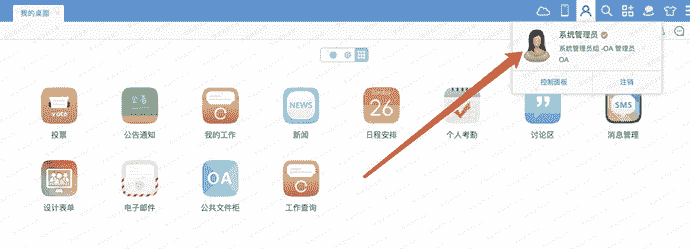

# 通达oa xss

> 原文：[https://www.zhihuifly.com/t/topic/3338](https://www.zhihuifly.com/t/topic/3338)

# 通达oa xss

## 一、漏洞简介

## 二、漏洞影响

2013、2015版本

## 三、复现过程

发邮件的地方、问题问答的地⽅都存在XSS，可获取他人账号权限。⼀般情况下，OA会有前端进行过滤， 所以抓包时候去添加payload，之后会对事件进行过滤，所以使用

poc

```
 
```





这个漏洞获取admin权限⾮常好用。想X谁X谁!