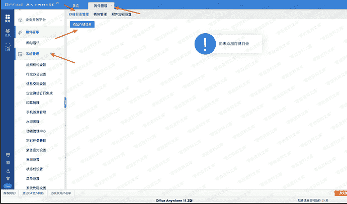
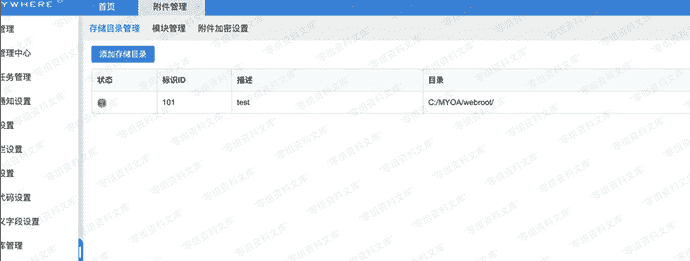
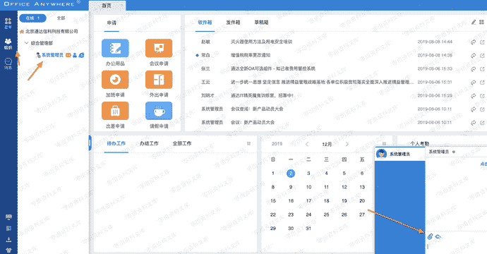
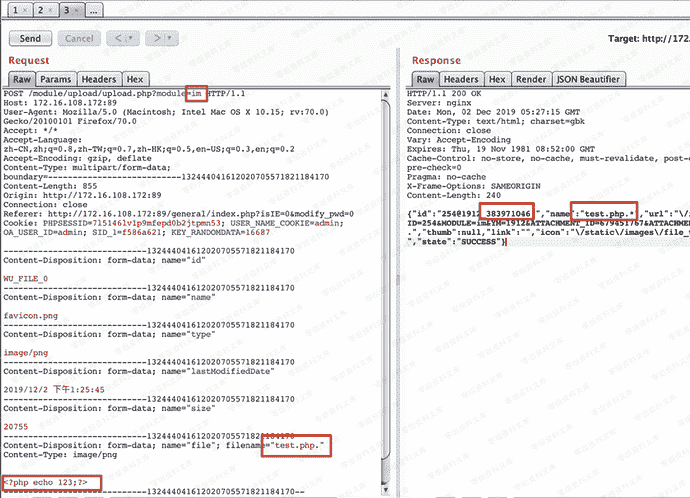
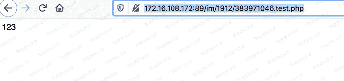
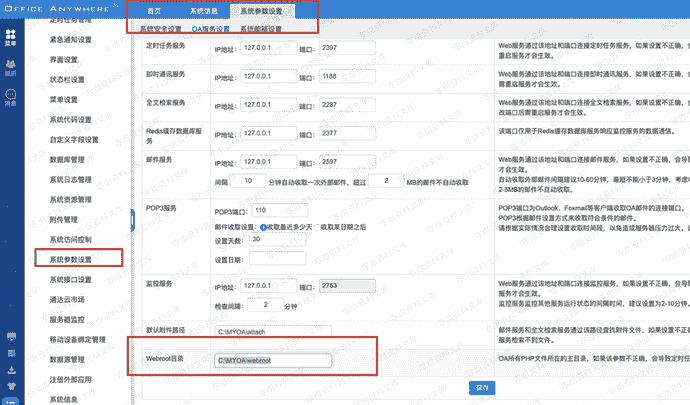

# 通达oa 11.2后台getshell

> 原文：[https://www.zhihuifly.com/t/topic/3342](https://www.zhihuifly.com/t/topic/3342)

# 通达OA 11.2 后台getshell

## 一、漏洞简介

## 二、漏洞影响

## 三、复现过程

系统管理-附件管理-添加存储目录

设置存储目录 （一般默认网站安装目录为 D:/MYOA/webroot/ 最后也有路径获取的地方，如果不设置会不在网站根目录下，无法直接访问附件）

寻找附件上传

通过.php. 绕过黑名单上传

根据返回结果拼接上传路径：/im/1912/383971046.test.php 直接访问（im是模块）

最后这有绝对路径的获取

