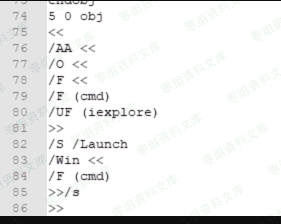
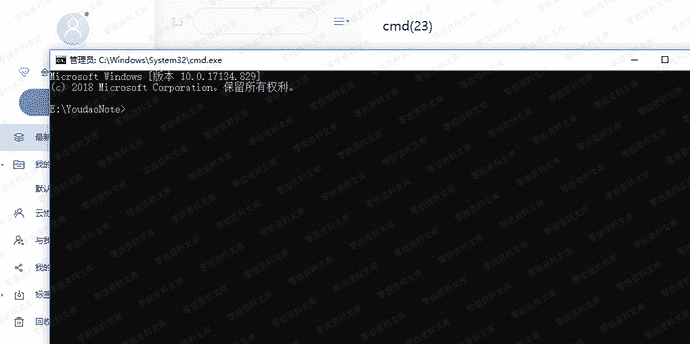
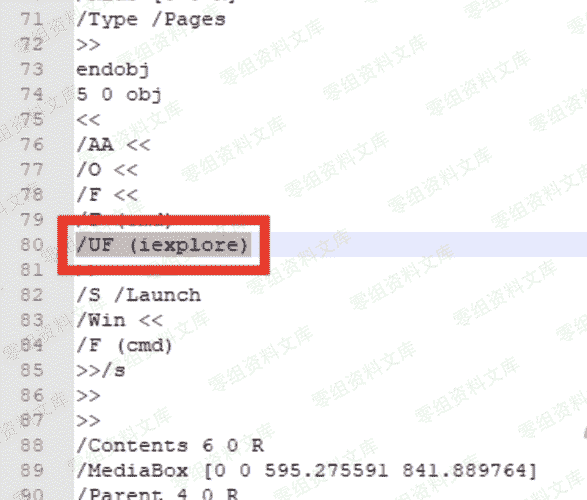

# 有道云笔记/印象笔记 windows客户端代码执行&本地文件读取

> 原文：[https://www.zhihuifly.com/t/topic/3369](https://www.zhihuifly.com/t/topic/3369)

# 有道云笔记/印象笔记 windows客户端代码执行&本地文件读取

## 一、漏洞简介

## 二、漏洞影响

## 三、复现过程

构造一个pdf，UF处是执行的地方，输入iexplore表示打开ie

在客户端上传就会触发：

打开cmd

用到的pdf：

改/UF (iexplore)即可：

/F（cmd）不用理会，这个是我测试的时候乱插的

具体技术详情不说了，感兴趣的搜索关键字“pdf漏洞“”pdf脚本执行”