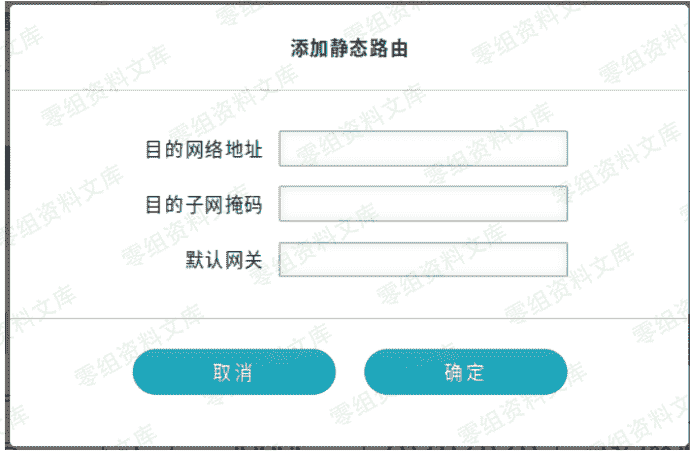
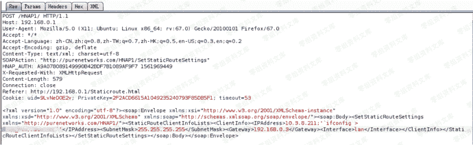

# （CVE-2019-13128）D-Link DIR-823G命令注入漏洞

> 原文：[https://www.zhihuifly.com/t/topic/3384](https://www.zhihuifly.com/t/topic/3384)

# （CVE-2019-13128） D-Link DIR-823G 命令注入漏洞

## 影响版本

```
DIR823GA1_FW102B03 
```

## 漏洞描述

```
这个问题存在于DIR823GA1固件FW102B03版本，网关(Gateway")的选项设置静态路由(SetStaticRouterSettings)，IP地址选项(IPAddress")，存在命令注入。 
```

### 漏洞POC

选择IP地址(IPAddress)提交信息，在数据包修改 。
如图所示。





### 参考链接

> https://github.com/TeamSeri0us/pocs/blob/master/iot/dlink/DIR-823G-v2.pdf