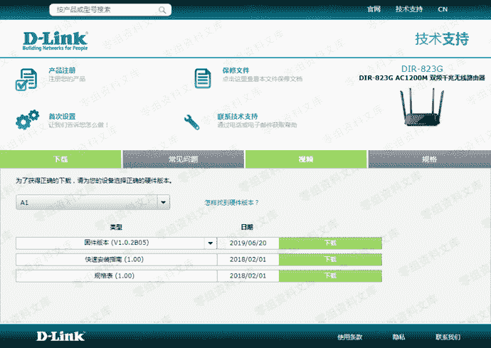
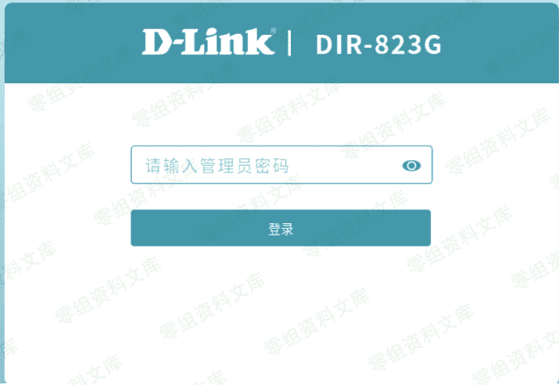
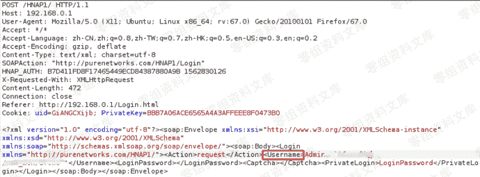
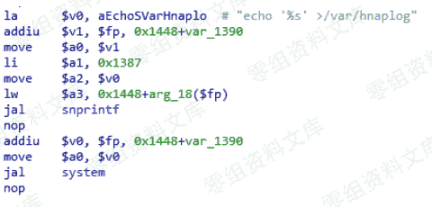
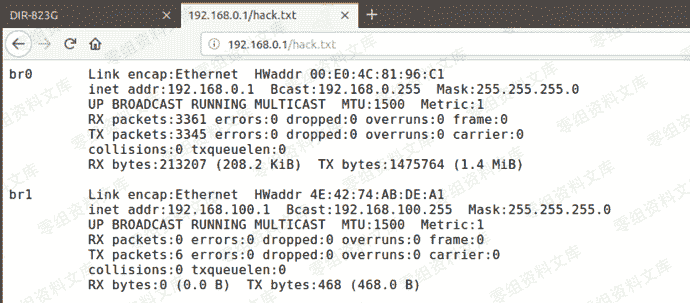

# （CVE-2019-15529）D-Link DIR-823G

> 原文：[https://www.zhihuifly.com/t/topic/3385](https://www.zhihuifly.com/t/topic/3385)

# （CVE-2019-15529）D-Link DIR-823G

## 一、漏洞简介

D-Link DIR-823G是中国台湾友讯（D-Link）公司的一款无线路由器。
使用1.0.2B05版本固件的D-Link DIR-823G中的HNAP1存在命令注入漏洞。该漏洞源于外部输入数据构造可执行命令过程中，网络系统或产品未正确过滤其中的特殊元素。攻击者可利用该漏洞执行非法命令。

## 二、漏洞影响

DIR823GA1_FW102B05

## 三、复现过程

1.下载D-Link DIR-823G固件，http://support.dlink.com.cn/ProductInfo.aspx?m=DIR-823G

2.在固件版本为V1.0.2B05的D-Link DIR823G设备上存在一个问题，能偶通过用户名字段中注入命令进行登录。

3.攻击载荷

4.漏洞细节

5.写入文件

原文地址:https://github.com/TeamSeri0us/pocs/blob/master/iot/dlink/823G-102B05-1.pdf