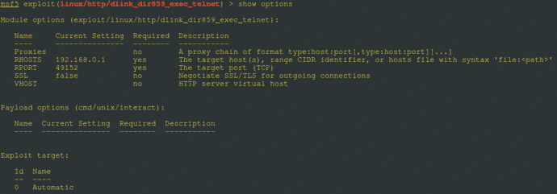
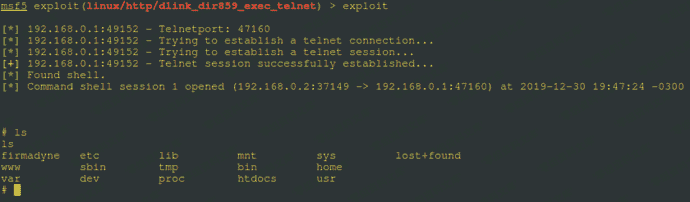
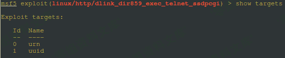
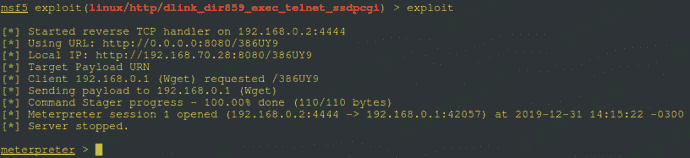
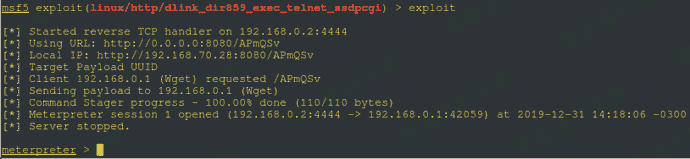

# （CVE-2019–17621）D-Link DIR-859 rce

> 原文：[https://www.zhihuifly.com/t/topic/3387](https://www.zhihuifly.com/t/topic/3387)

# （CVE-2019–17621）D-Link DIR-859 rce

## 一、漏洞简介

D-Link DIR-859是中国台湾友讯（D-Link）公司的一款无线路由器。 D-Link DIR-859 1.05版本和1.06B01 Beta01版本中涉及UPnP请求的代码存在安全漏洞。远程攻击者可借助特制的HTTP SUBSCRIBE请求利用该漏洞以root权限执行系统命令。

## 二、漏洞影响

D-Link DIR-859 1.05版本和1.06B01 Beta01版本

## 三、复现过程

https://github.com/ianxtianxt/D-Link-DIR-859-RCE

### SUBSCRIBE Exploit

### M-SEARCH Exploit

#### Targets

### Payload with (URN:)

### Payload with (UUID:)

