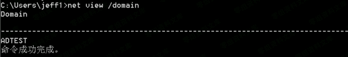
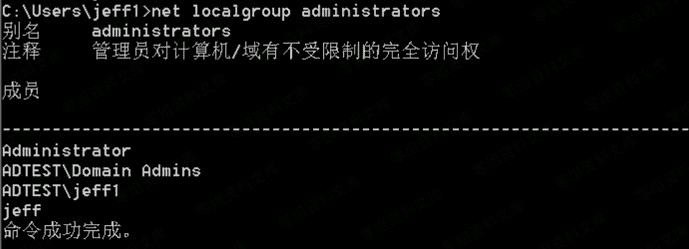
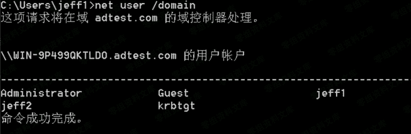
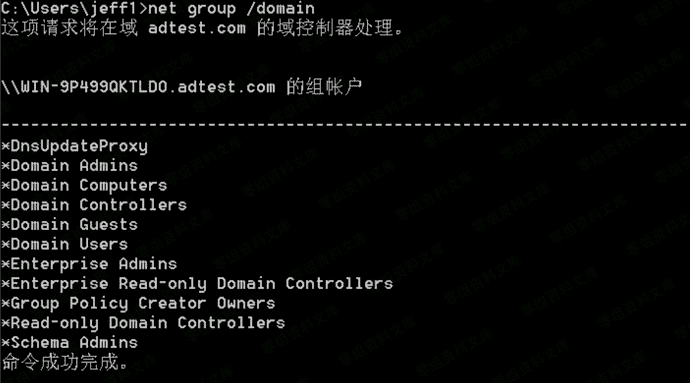
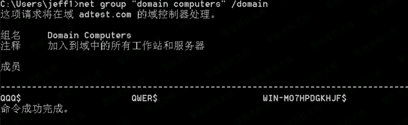
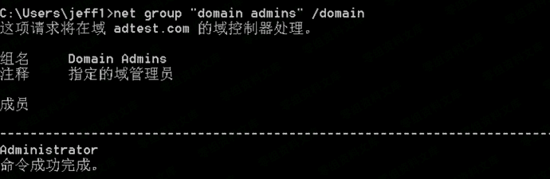
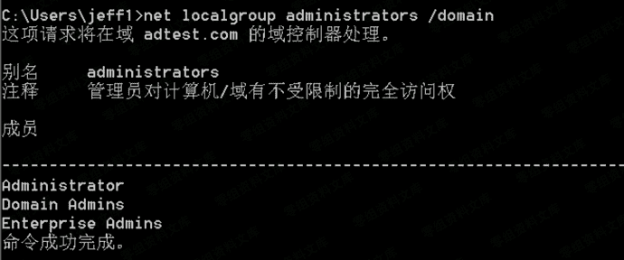
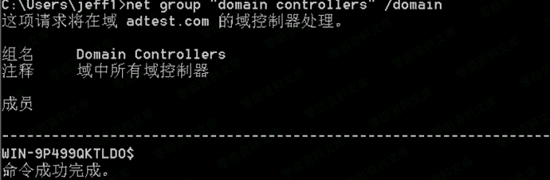
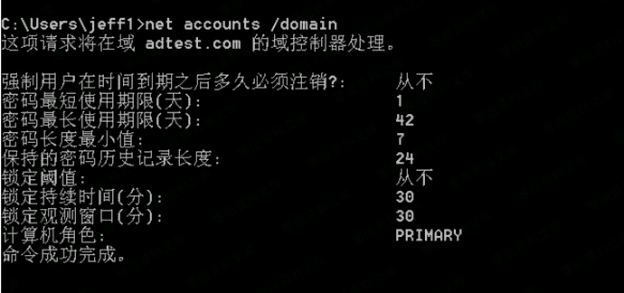

# 3.1 判断是否是域环境

> 原文：[https://www.zhihuifly.com/t/topic/3413](https://www.zhihuifly.com/t/topic/3413)

# 3.1 判断是否是域环境

## 命令汇总

```
net view /domain 查询域列表

net time/domain 从域控查询时间，若当前用户是域用户会从域控返回当前时间，亦用来判 断主域，主域一般用做时间服务器

net localgroup administrators 本机管理员【通常含有域用户】

net user /domain 查询域用户(当前域)

net group /domain 查询域工作组

net group “domain computers” /domain 查看加入域的所有计算机名

net group “domain admins” /domain 查询域管理员用户组和域管用户

net localgroup administrators /domain 查看域管理员

net group “domain controllers” /domain 查看域控 `net accounts /domain 查看域密码策略` 
```

## 命令截图

```
net view /domain 查询域列表 
```



```
net time/domain 从域控查询时间，若当前用户是域用户会从域控返回当前时间，亦用来判 断主域，主域一般用做时间服务器 
```


```
net localgroup administrators 本机管理员【通常含有域用户】 
```



```
net user /domain 查询域用户(当前域) 
```



```
net group /domain 查询域工作组 
```



```
net group "domain computers" /domain 查看加入域的所有计算机名 
```



```
net group "domain admins" /domain 查询域管理员用户组和域管用户 
```



```
net localgroup administrators /domain 查看域管理员 
```



```
net group "domain controllers" /domain 查看域控 
```



```
net accounts /domain 查看域密码策略 
```

