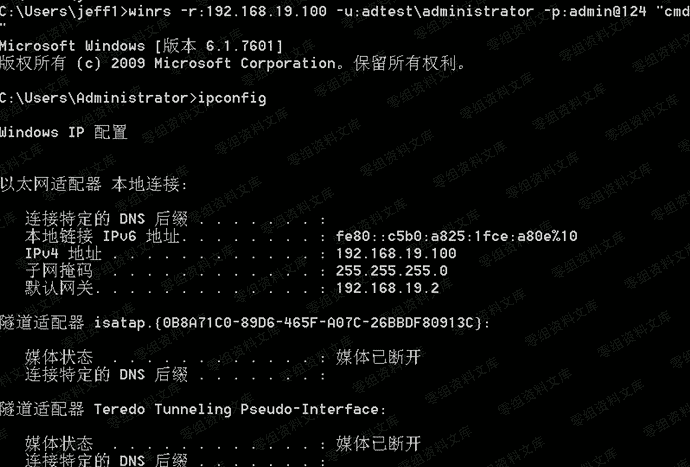
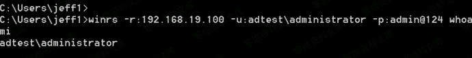

# 4.2.3.2 WINRS

> 原文：[https://www.zhihuifly.com/t/topic/3427](https://www.zhihuifly.com/t/topic/3427)

#### 4.2.3.2 WINRS

winrs(windows remote shell)是 WinRM 的客户端,需要管理员权限才能运行，可直接执行 命令，也可以返回交互式 shell

```
winrs -r:192.168.19.100 -u:adtest\administrator -p:admin@124 "cmd” 
```



```
winrs -r:192.168.19.100 -u:adtest\administrator -p:admin@124 whoami 
```

