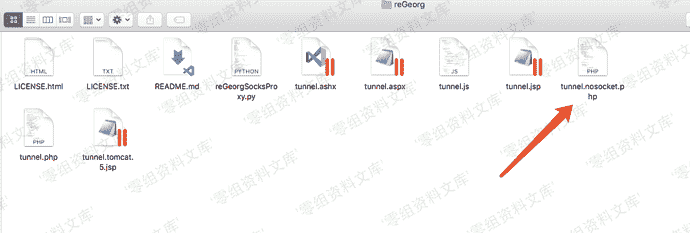
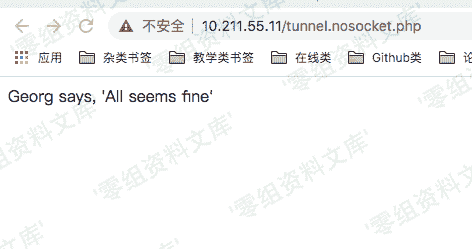
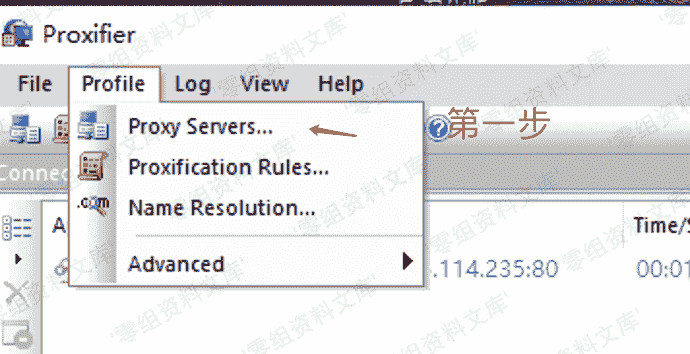
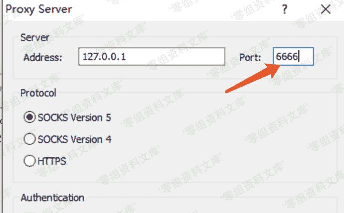
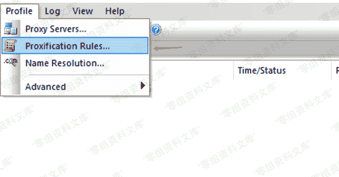
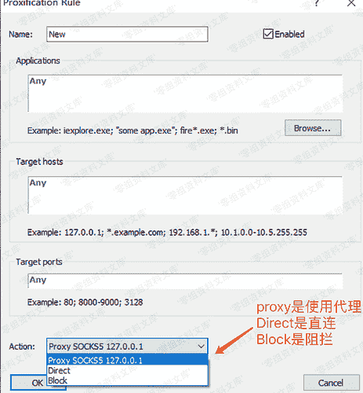
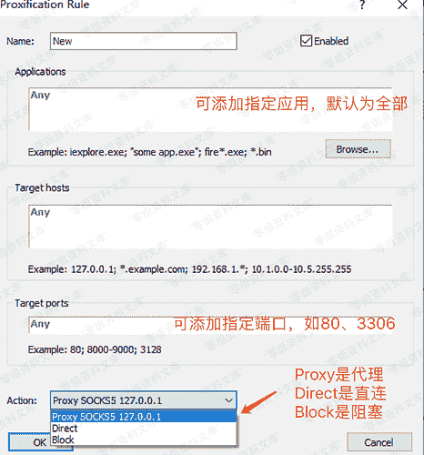

# reGeorg

> 原文：[https://www.zhihuifly.com/t/topic/3452](https://www.zhihuifly.com/t/topic/3452)

# reGeorg

reGeory适用于公网服务器只开放了80端口的情况。

reGeorg是用 python 写的利用Web进行代理的工具，流量只通过 http 传输，也就是http隧道。

```
reGeorg 下载https://github.com/sensepost/reGeorg 
```




上传对应语言版本的tunnel文件到服务器上。然后本地访问上传的源文件，即可在本地与远程主机上形成一个http的回路。命令如下：

```
python reGeorgSocksProxy.py -p 6666 -u http://目标站点/xxx.php //端口随便指定，只要不与本机开放端口冲突即可 
```

## Proxychains代理及配置方法

配置**proxychains**代理链的配置文件

***vim /etc/proxychains.conf*** ，将代理设置成本机的1080端口：

```
socks5 127.0.0.1 6666 
```

然后命令前面加上 **proxychains**即可。如：

```
proxychains curl 内网ip 
```

## Proxifier代理及配置方法

> 以上proxychains工具大多数情况下在mac/linux上使用，Windows下可以使用proxifier

*   创建代理服务器





*   设置代理规则







选中刚设置好的代理服务器就行了

所以我们流量的走向是： 流量->本地1080端口->web服务器的80端口(通过我们上传的php文件进行流量转发)->内网服务器->web服务器的80端口->本地1080端口