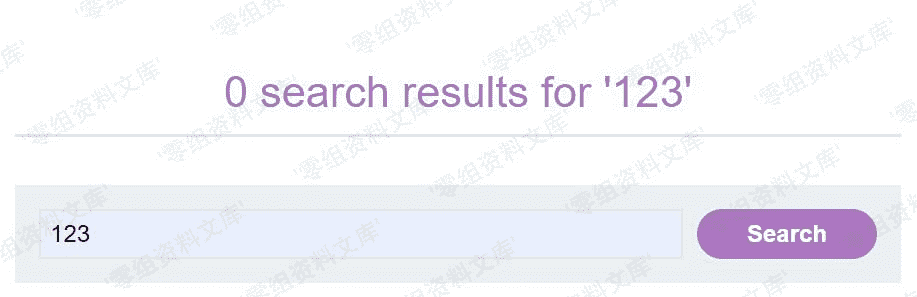
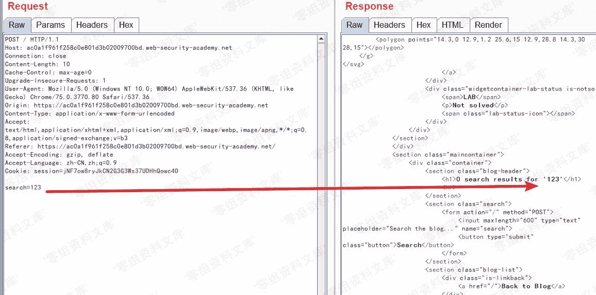
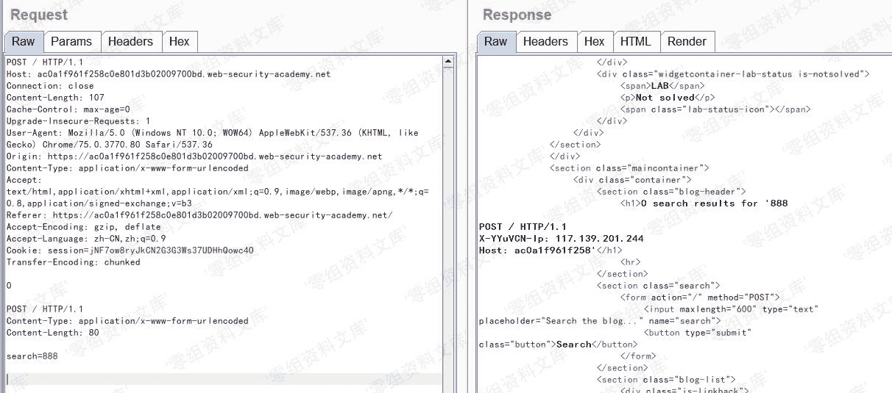
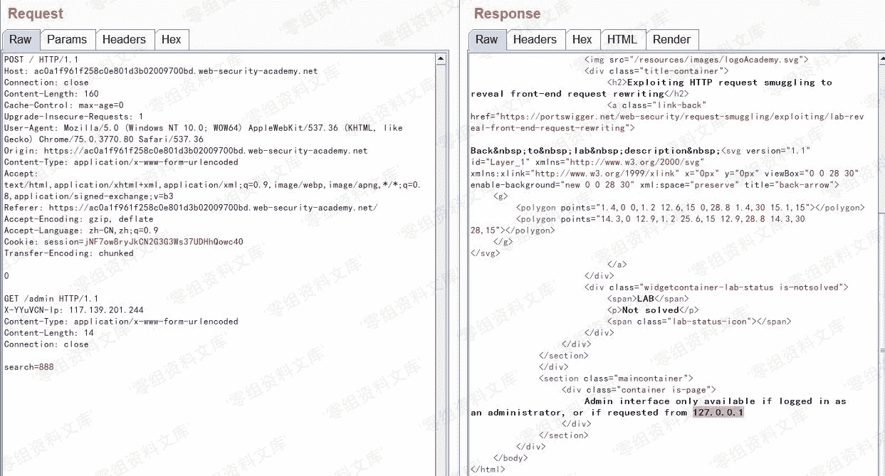
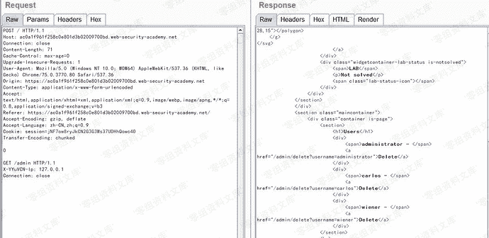
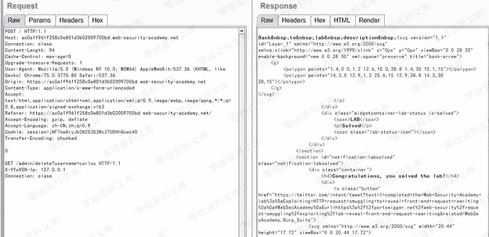

# 利用请求走私获取前端服务器重写请求字段

> 原文：[https://www.zhihuifly.com/t/topic/3482](https://www.zhihuifly.com/t/topic/3482)

### 利用请求走私获取前端服务器重写请求字段

在这种网络环境下，前端代理服务器在接收到请求后不会直接将请求转发给后端服务器，而是先添加一些必要的字段然后转发给后端服务器。

如果不能获取到前端代理服务器添加或重写的字段，那么我们走私的请求就无法被后端服务器处理。

如何获取这些值，这里有一个简单的方法：

1.  找一个能够将请求参数的值输出到响应中的POST请求
2.  把该POST请求中，找到的这个特殊的参数放在消息的最后面
3.  然后走私这一个请求，然后直接发送一个普通的请求，前端服务器对这个请求重写的一些字段就会显示出来。

**实验地址**：https://portswigger.net/web-security/request-smuggling/exploiting/lab-reveal-front-end-request-rewriting

**实验描述**：

本实验中前端服务器不支持分块编码，即CL-TE

现有一个管理员面板/admin，但只有IP地址为127.0.0.1的用户才能访问。前端服务器将HTTP头添加到到包含其IP地址的传入请求中。类似于XXF头，但名称不一样。

要完成本实验，需要向后端服务器走私一个请求，以显示前端服务器添加的HTTP头。然后再构造包含该HTTP头的走私请求，最终删除用户carlos。

**实验过程**

进入发现有一个搜索框

并且请求参数中的值能够输出到相应的POST请求中

构造一个走私请求数据包，多次发送在前端中显示了HTTP请求

> 解释一下：走私请求数据包中Content-length: 80，显然自身携带数据没有达到这个数目。
> 
> 因而后端服务器会在收到第一个走私请求时会误以为该请求还没有结束，将不断接受新传来的HTTP请求直到长度达到80。
> 
> 因此添加在search=888后的HTTP请求也成POST请求的一部分，最终将前端服务器添加的HTTP头显示在页面

将获取的HTTP头添加到走私请求中，再次发送数据包

最终成功删除用户

