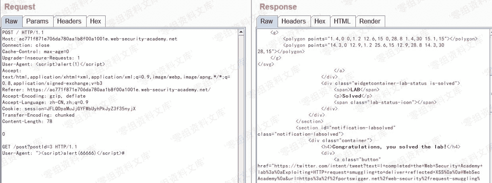
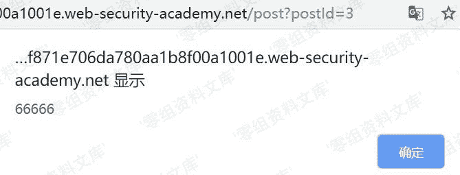

# 利用请求走私传入XSS

> 原文：[https://www.zhihuifly.com/t/topic/3484](https://www.zhihuifly.com/t/topic/3484)

### 利用请求走私传入XSS

通过HTTP请求走私搭配反射型XSS进行攻击，这样不需要与受害者交互即可发起攻击。

**实验地址**：https://portswigger.net/web-security/request-smuggling/exploiting/lab-deliver-reflected-xss

**实验描述**：

CL-TE

本实验可通过User-Agent传入XSS，通过将HTTP请求走私到后端服务器，该请求导致下一个用户的请求将接收到包含执行alert(1)的XSS漏洞响应。

**实验过程**：

其他用户如果在攻击者将请求走私到后端服务器之后访问该页面，将弹框

