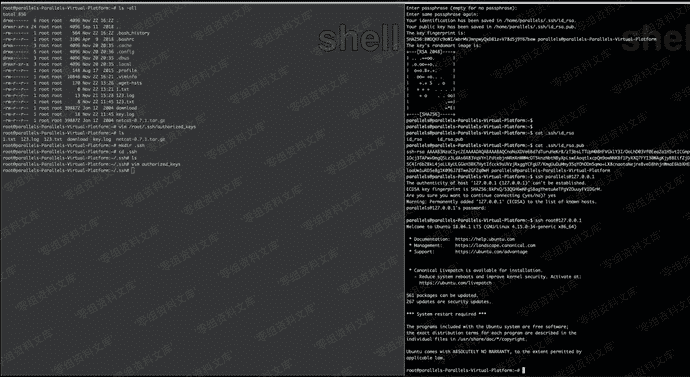

# SSH 公钥免密登陆

> 原文：[https://www.zhihuifly.com/t/topic/3487](https://www.zhihuifly.com/t/topic/3487)

# SSH 公钥免密登陆

ssh-keygen -t rsa //生成公钥

将id_rsa.pub内容放到目标.ssh/authorized_keys里

这个是老生常谈的公钥免登陆，这种用法不只是用在留后门，还可以在一些特殊情况下获取一个交互的shell，如struts写入公钥，oracle写入公钥连接等情景。