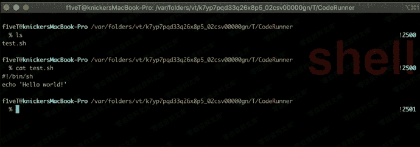
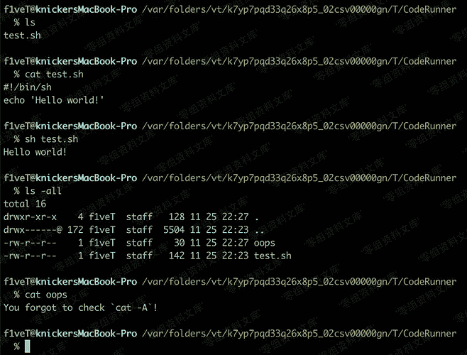

# hiding-from-cats

> 原文：[https://www.zhihuifly.com/t/topic/3491](https://www.zhihuifly.com/t/topic/3491)

# hiding-from-cats

**cat隐藏说明**

刚刚在cron里面提到了cat的一个缺陷。可以利用这个缺陷隐藏恶意命令在一些脚本中。这里的示例我就用hiding-from-cats里的例子吧。之所以单列出来，个人认为在一些大型企业的运维工具脚本中可以插入恶意代码，利用cat的缺陷还可以使管理员无法发现脚本被做手脚。

cat其实默认使用是支持一些比如\r回车符 \n换行符 \f换页符、也就是这些符号导致的能够隐藏命令。

使用python生成带有换行符的内容sh：

```
cmd_h = "echo 'You forgot to check `cat -A`!' > oops" # hidden
cmd_v = "echo 'Hello world!'"                         # visible `with open(“test.sh”, “w”) as f:

output = “#!/bin/sh\n”

output += cmd_h + “;” + cmd_v + " #\r" + cmd_v + " " * (len(cmd_h) + 3) + “\n”

f.write(output)` 
```



使用coderunner生成了一个test.sh脚本。cat看了下脚本的内容是echo一个hello world! 且同目录下只有他本文件。然后我们用sh test.sh执行后。



可以看到执行脚本后生成了一个oops文件，内容就是 You forgot to check cat -A! 其实可以看出来这样就做到了恶意命令隐藏的效果。其实之前Cron后门中的隐藏方法就是利用了这个。如果使用cat —A 查看root文件的话就可以看到计划任务的真正内容了。