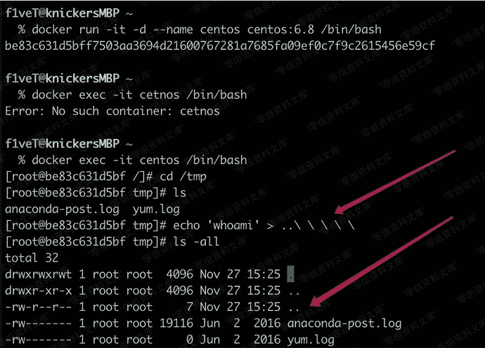
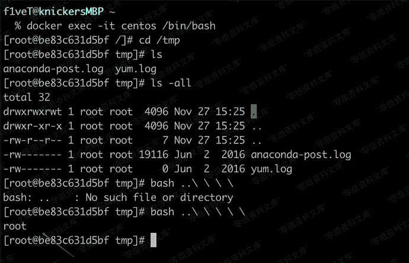

# 建立..文件/文件夹

> 原文：[https://www.zhihuifly.com/t/topic/3495](https://www.zhihuifly.com/t/topic/3495)

# 建立..文件/文件夹

```
echo 'whoami'  > ..\ \ \ \ //注意最后一个转义符后有一个空格 
```



```
bash ..\ \ \ \ \ //这里也是多一个空格。 
```



这样建立的文件/文件夹管理员不知道是使用了几个转义符建立的，所以通过rm+tab是无法删除的。而且我测试使用rm -rf ./*也无法删除。