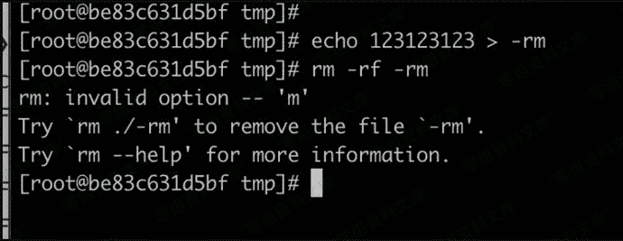
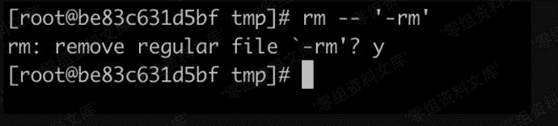
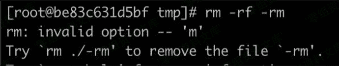
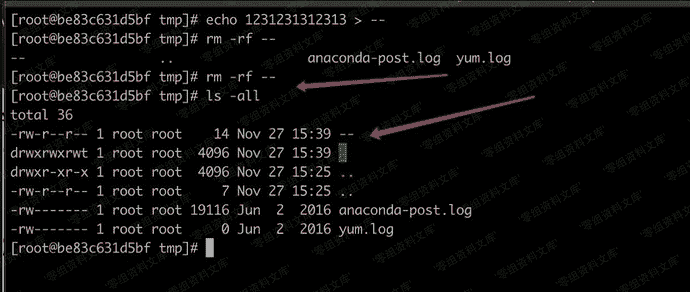

# 参数混淆拦截rm

> 原文：[https://www.zhihuifly.com/t/topic/3496](https://www.zhihuifly.com/t/topic/3496)

# 参数混淆拦截rm

使用echo等工具新建一个文件名是-rm的文件，这样删除的时候bash会认为-rmt是rm的参数。



这样就可以阻止管理员去删除， 一般只有rm -- '-rm'才会删除掉。



但是如果管理员使用正常删除方式会报错。



可以用以下方法。

```
echo 123123123 > -- 
```



这样可以看到，命令执行了，文件没删除，命令也没有报错。类似的可以利用bash的\r缺陷，和管道符、重定向符之类的。