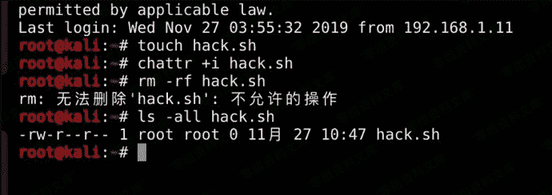

# 创建不能删除的文件

> 原文：[https://www.zhihuifly.com/t/topic/3497](https://www.zhihuifly.com/t/topic/3497)

# 创建不能删除的文件（权限隐藏）

这个用法在ctf、awd中应用很多，使用chattr来给与隐藏权限。 这些权限需要使用lsattr这个命令才可以查看到，而如果要修改隐藏权限，则使用chattr这个命令来进行修改。

```
chattr +i hack.sh 
```



无法删除。