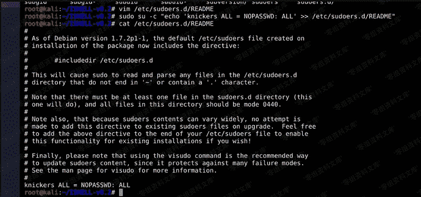
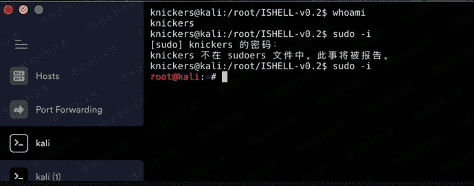

# sudoers利用

> 原文：[https://www.zhihuifly.com/t/topic/3504](https://www.zhihuifly.com/t/topic/3504)

## sudoers 利用

sudo命令可以使用户临时获得管理员权限执行命令，sudo的控制都是基于sudoers文件来控制的，里面限制了用户名，用户组，执行什么等。/etc/sudoers的通用格式为：user host runas command user:一位或几位用户，在/etc/group中可以用一个%代替它，组对象的名称一定要用百分号%开头。host:一个或几个主机名；runas:作为哪个用户运行，常见选项是root和ALL command:想让用户或组运行的一个或几个根级别命令。例如：hans ALL=(root) useradd,userdel 授权hans用户在所有计算机上以root身份运行useradd,userdel命令。这样我们用一句话将内置/或者我们自己添加的普通权限用户添加到sudoer列表中，这样就可以偷着执行管理员权限的命令了。将原本低权限用户当做后门使用。

```
sudo su -c "echo 'hack ALL = NOPASSWD: ALL' >> /etc/sudoers.d/README" 
```





可以看到我们不需要密码就可以直接提到root。